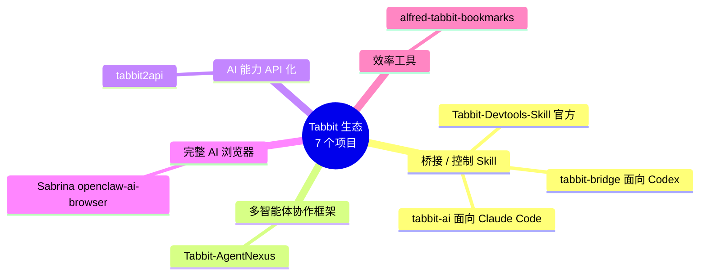

https://github.com/hoangvannam80116-collab/tabbit-bridge

https://github.com/Tabbit-Browser/Tabbit-Devtools-Skill

https://github.com/jiaqi015/openclaw-ai-browser

https://github.com/cuckoohello/alfred-tabbit-bookmarks

https://github.com/David-JA/Tabbit-AgentNexus

https://github.com/hoinata/tabbit2api

https://github.com/liu184205909/tabbit-ai
多维度对比以上项目

I'll fetch the content from all these GitHub repositories to compare them across multiple dimensions.

### **七个项目分属四类:浏览器桥接 Skill(4个)、API 适配器(1个)、完整 AI 浏览器(1个)、效率工具(1个),分别面向 Codex、Claude Code、OpenClaw、Alfred 等不同生态接入 Tabbit。**

虽然都围绕 Tabbit 浏览器,但这七个仓库的定位差异极大,甚至存在两个相反的方向——一类是**把 Tabbit 当作"被操控的浏览器"去自动化**,另一类是**把 Tabbit 内置 AI 当作"可复用的能力后端"去调用**。下图先给出整体分类:



**定位与技术机制对比**

| 项目 | 品类定位 | 核心技术机制 | 主要语言 | 官方/社区 |
| --- | --- | --- | --- | --- |
| Tabbit-Devtools-Skill | 通用 Agent 连接 Skill | CDP/DevTools 端点 → 委托 `agent-browser` | Skill 包装 | **官方** |
| tabbit-bridge | Codex↔Tabbit 执行桥接 | MCP + CDP + DOM + macOS 辅助功能 + 下载监听 | TypeScript | 社区 |
| tabbit-ai (liu184205909) | Claude Code Skill | CDP Proxy(:3456)+ web-access skill,复用内置 AI | Node.js | 社区 |
| Tabbit-AgentNexus | 多智能体协作框架 | E2B sandbox + 挂载目录 + 网页自动化 | Python | 社区 |
| tabbit2api | API 适配器 | FastAPI + Docker,封装内部接口 | Python | 社区(非官方) |
| Sabrina (openclaw-ai-browser) | 完整 AI 浏览器 | Electron 桌面端 + 可插拔 driver | TypeScript/Electron | 社区(外围/竞品) |
| alfred-tabbit-bookmarks | Alfred 效率工具 | Python 脚本读取书签/历史/标签 | Python | 社区 |

**生态接入与成熟度对比**

| 项目 | 上游/集成对象 | 平台 | 提交/发布 | License |
| --- | --- | --- | --- | --- |
| Tabbit-Devtools-Skill | 支持 Skills 的 Agent | macOS/Windows | 4 commits | MIT |
| tabbit-bridge | Codex | macOS | 4 commits / 4 releases | MIT |
| tabbit-ai (liu184205909) | Claude Code | 跨平台(依赖 Node) | 2 commits | MIT |
| Tabbit-AgentNexus | Web Agent(GPT)+ Tabbit Agent | 跨平台(E2B) | 37 commits / 无 | 未标注 |
| tabbit2api | Cherry Studio / Trae 等 | 跨平台(Docker) | 8 commits | MIT |
| Sabrina | OpenClaw | macOS | 28 commits / 15 releases | MIT |
| alfred-tabbit-bookmarks | Alfred | macOS | 2 commits / 2 releases | MIT |

**维度一:控制方向——"操控浏览器"还是"复用 AI"**

这是七者最本质的分野。**Tabbit-Devtools-Skill** 是最纯粹的"操控浏览器"代表,它本身不实现任何自动化逻辑,只负责找到 Tabbit 的 `DevToolsActivePort` 并把 CDP 端点交给官方 `agent-browser` 去执行页面操作,定位克制而清晰。**tabbit-bridge** 则是混合型:既用 CDP 管理标签页、读取 DOM,又把右侧 Tabbit Chat 面板当作"执行 Agent",让 Codex 充当大脑、Tabbit 充当手脚。相对地,**liu184205909/tabbit-ai** 和 **tabbit2api** 走的是"复用 AI"路线——前者通过 CDP 操控 Tabbit 内置 AI 聊天(基于 GPT-5.5)实现所谓"零成本"多轮对话与信息提取,后者更进一步,把 Tabbit 内置 AI 封装成 OpenAI/Claude 兼容的标准 API,从而能在 Cherry Studio、Trae 等第三方工具里当模型用。[GitHub](https://github.com/Tabbit-Browser/Tabbit-Devtools-Skill) [GitHub](https://github.com/hoinata/tabbit2api)

**维度二:官方背书与可信度**

七个项目里**只有 Tabbit-Devtools-Skill 出自官方 `Tabbit-Browser` 组织**,其余均为个人开发者的社区作品。这一点直接影响可信度与长期维护预期:官方 Skill 强调"只做连接、不碰自动化实现"的边界,合规性最高;而 tabbit2api 明确自称"非官方 API 适配器",需要填入 Tabbit 账户 Token 并逆向其内部接口,属于灰色地带,使用前需自行评估账号与合规风险。[GitHub](https://github.com/hoangvannam80116-collab/tabbit-bridge)

**维度三:复杂度与野心**

按工程体量和目标可分为三档。**最重量级**是 Sabrina(openclaw-ai-browser)与 Tabbit-AgentNexus:前者是一个基于 Electron 的完整桌面 AI 浏览器(28 commits、15 个发布版本、提供 `.dmg`),功能覆盖 Agent 模式、Coding GenTab、多标签引用、四种连接方式等,实际上是 OpenClaw 阵营的浏览器入口,把 Tabbit 列为对比竞品而非依赖对象;后者(37 commits)则是一套宏大的多智能体协作框架,规划了 N0–N7 的能力路线图,围绕 E2B sandbox、受控权限、审计记录和人工确认边界做"Web Agent + Tabbit Agent 双 Agent 协作环"。**中量级**是 tabbit2api(8 commits),作为单一用途的 API 网关已较完整。**轻量级**则是 tabbit-bridge、liu184205909/tabbit-ai 和 alfred-tabbit-bookmarks,普遍只有 2–4 次提交,聚焦单点功能。[GitHub](https://github.com/jiaqi015/openclaw-ai-browser) [GitHub](https://github.com/David-JA/Tabbit-AgentNexus)

**维度四:技术栈与平台**

语言上呈现明显的两极:**TypeScript/Electron 系**(Sabrina、tabbit-bridge)偏向桌面端与浏览器集成;**Python 系**(tabbit2api、AgentNexus、alfred-bookmarks)偏向服务端、沙箱与脚本工具;**Node.js 脚本**(liu184205909/tabbit-ai)则是最轻的单文件 Skill。平台上,凡是依赖 macOS 辅助功能(tabbit-bridge)、Alfred(alfred-bookmarks)或打包成 `.dmg`(Sabrina)的项目都**仅限 macOS**;而 tabbit2api(Docker)、AgentNexus(E2B)、官方 Skill(同时给出 macOS 与 Windows 的端口路径)则具备**跨平台**能力。[GitHub](https://github.com/cuckoohello/alfred-tabbit-bookmarks) [GitHub](https://github.com/liu184205909/tabbit-ai)

**选型建议**

如果你的目标是**让某个 Agent 框架去自动操作 Tabbit**,优先选官方的 Tabbit-Devtools-Skill(通用、合规),Codex 用户可叠加 tabbit-bridge,Claude Code 用户则用 liu184205909/tabbit-ai;如果想**把 Tabbit 的 AI 当模型在别处调用**,选 tabbit2api;如果追求**完整的 AI 浏览器体验**或本就在用 OpenClaw,Sabrina 是唯一的成品;若是**复杂的多智能体协作与代码评审**研究场景,AgentNexus 最贴合;而只想**更快地搜书签和历史**,alfred-tabbit-bookmarks 是零配置、即装即用的最优解。

值得注意的是,这七个项目里许可证清晰的六个都采用 MIT,唯独 Tabbit-AgentNexus 仓库中未见明确的 LICENSE 文件,若要二次开发或商用需先向作者确认授权。

搜索查找tabbit浏览器相关的其他项目

I'll search the web for other Tabbit browser-related projects.I found several new projects. Let me fetch more details on the GitHub topic page, the Tabbit-Browser organization, and search for additional projects.

I found new projects. Let me verify a couple more potential repos referenced in the searches (the `tabb2` upstream project and any other API forks).

### **除已对比的 7 个项目外,新发现 3 个 Tabbit 相关项目:Raycast 扩展 `tabbit-raycast-extension`、API 适配器上游 `hih24337/tabb2`、以及官方组织 fork 的沉浸式翻译插件 `read-frog`(陪读蛙)。**

我从 GitHub `tabbit` 话题页、官方 `Tabbit-Browser` 组织以及多轮网络检索中,梳理出在上一轮 7 个项目之外、确实与 Tabbit 浏览器直接相关的新项目。整体来看,公开生态规模仍然很小——GitHub 的 `tabbit` 话题下目前仅 3 个仓库,而且 Tabbit 本身的开源痕迹主要集中在官方组织和几个个人开发者手里。[GitHub](https://github.com/topics/tabbit)

**新发现的项目**

| 项目 | 类型 | 核心功能 | 技术栈 | 来源 |
| --- | --- | --- | --- | --- |
| AkaChou/tabbit-raycast-extension | Raycast 扩展 | 从 Raycast 打开/搜索/切换 Tabbit 标签页,搜索历史与书签,新建窗口/无痕窗口 | TypeScript | 已上架 Raycast Store |
| hih24337/tabb2 | API 适配器(原项目) | 将 Tabbit 内部 API 转为 OpenAI/Claude 兼容接口,多账号集成 | Python / FastAPI / Docker | tabbit2api 的上游参考项目 |
| Tabbit-Browser/read-frog | 浏览器翻译插件(官方 fork) | 沉浸式翻译、文章解析、多 AI 模型、划词翻译、TTS | TypeScript / WXT | 官方组织 fork 自 mengxi-ream/read-frog |

**Raycast 扩展:tabbit-raycast-extension**

这是与上一轮 `alfred-tabbit-bookmarks` 高度对应的"另一半"——前者服务 Alfred,后者服务 Raycast。它通过 Tabbit 的应用包标识 `com.tab-browser.Tabbit` 启动浏览器,直接读取 `~/Library/Application Support/Tabbit Browser/Default` 下的本地配置来检索历史与书签,无需账号、API Key 或额外服务。功能上提供"新建窗口/标签页/无痕窗口""在 Tabbit 中打开 URL 或用指定搜索引擎搜索""统一搜索标签页+历史+书签"等命令,并支持区分国内版(`Tabbit Browser.app`)与国际版(`Tabbit.app`)。它已正式上架 Raycast Store,定位是纯粹的 macOS 效率工具。[GitHub](https://github.com/AkaChou/tabbit-raycast-extension) [Raycast Store](https://www.raycast.com/AkaChou/tabbit)

**API 适配器的"祖先":hih24337/tabb2**

上一轮提到的 `hoinata/tabbit2api` 在其 README 里明确写着"参考了 hih24337/tabb2 的设计思路和实现方式",而 tabb2 正是这条路线的原始项目。两者几乎同源:都用 Python + FastAPI + Docker,都把 Tabbit 内部 API 封装成 `/v1/chat/completions`(OpenAI)和 `/v1/messages`(Claude)两套兼容端点,都带 `/admin` 管理面板和多 Token(多账号)管理,默认端口同为 8800。区别在于 tabbit2api 是其下游演进版,补充了更完整的模型列表、Cherry Studio/Trae 接入指南和环境变量配置。这意味着这一类"把 Tabbit 当免费模型后端"的非官方适配器,实际上是同一套代码的多个分支。[GitHub](https://github.com/hih24337/tabb2)

**官方组织里的 read-frog(陪读蛙)**

这是最值得单独说明的一个。`Tabbit-Browser/read-frog` 是官方组织 fork 自独立开发者 mengxi-ream 的开源沉浸式翻译插件"陪读蛙",功能包括双语/仅译文切换、上下文感知翻译、划词翻译、自定义 Prompt、批量请求省 token、20+ AI 提供商接入、YouTube 字幕翻译和 TTS 等。它出现在官方仓库里,源于 2026 年 3 月的一桩开源合规风波:美团光年之外团队的 Tabbit 在开发翻译功能时 fork 并使用了该项目代码,但未及时跟进原作者后续添加的 GPLv3 协议,被原作者公开维权;最终 Tabbit 完整开源了相关代码并取得原作者的正式商业授权,双方和解。因此这个 fork 既是 Tabbit 翻译功能的代码来源,也是该事件的合规处理结果。[InfoQ](https://www.infoq.cn/article/QpgxweT242UrUwxgNu0y) [新浪财经](https://finance.sina.com.cn/tech/roll/2026-03-03/doc-inhpsxzn7584377.shtml)

**关于完整性**

需要说明的是,这三个就是本轮检索能稳定确认的新增直接相关项目;GitHub `tabbit` 话题页其余两个(`liu184205909/tabbit-ai`、`jiaqi015/openclaw-ai-browser`)以及官方的 `Tabbit-Devtools-Skill` 都已在上一轮覆盖。由于 Tabbit 是 2026 年新发布的产品,社区项目多为个人小仓库、命名也不统一(有的用 `tab`、`tabb`、`tab-browser` 等变体且未打 `tabbit` 话题标签),不排除还有少量未被话题收录或搜索引擎尚未索引的零散仓库。如果你希望,我可以进一步针对某一类(例如 MCP 工具、API 适配器分支、或浏览器自动化 Skill)做定向深挖。

其他的项目对两个api适配器类项目的更新优化有参考价值吗?

### **有参考价值，但不是“直接抄功能”，而是能为两个 API 适配器项目提供三类优化方向：连接稳定性、能力边界、安全治理。**

这里的两个 API 适配器类项目主要是 `hih24337/tabb2` 和 `hoinata/tabbit2api`。它们的核心目标是把 Tabbit 内部 AI 能力包装成 OpenAI / Claude 兼容 API。因此，其他项目中最有参考价值的不是 Raycast、Alfred 这类效率入口本身，而是那些处理了 **Tabbit 连接、会话状态、任务边界、浏览器侧上下文、权限控制、审计记录** 的项目。

### **最有参考价值的项目排序**

| 参考价值 | 项目 | 对 API 适配器的启发 |
| --- | --- | --- |
| 高 | `tabbit-bridge` | 连接探测、任务状态、下载解析、Tabbit Chat 结果读取、MCP 工具化 |
| 高 | `Tabbit-Devtools-Skill` | DevTools 端点发现、跨平台路径兼容、最小化连接层设计 |
| 高 | `Tabbit-AgentNexus` | 权限边界、审计记录、轮次上限、失败上限、人类确认机制 |
| 中 | `liu184205909/tabbit-ai` | 通过 CDP 复用 Tabbit 内置聊天、多轮会话、读取增量回复 |
| 中 | `tabbit-raycast-extension` | 本地 Profile 路径识别、国内版/国际版区分、无账号配置体验 |
| 中低 | `alfred-tabbit-bookmarks` | 书签/历史/标签页检索能力,可作为上下文增强入口 |
| 低 | `openclaw-ai-browser/Sabrina` | 产品层面参考较多,代码层面对 API 适配器帮助有限 |
| 低但特殊 | `read-frog` | 多模型配置、Prompt 模板、批量请求、流式输出体验可参考 |

### **一、`tabbit-bridge` 对 API 适配器最有工程参考价值**

`tabbit-bridge` 的定位虽然不是 API 网关,而是让 Codex 通过 MCP 控制 Tabbit,但它的工程结构对 `tabb2/tabbit2api` 很有价值。原因是它把 Tabbit 视为一个真实运行环境,而不是只把 Tabbit 当作远端 HTTP API。

两个 API 适配器目前的主要形态是:用户提供 Tabbit Token,服务端封装 `/v1/chat/completions` 和 `/v1/messages`。这种方式轻量,但风险在于一旦 Tabbit 内部接口变化、Token 失效、模型列表变化、返回格式变化,服务端就容易失效。`tabbit-bridge` 的启发是可以增加一层 **运行时健康探测与状态可观测性**。

可参考优化包括:

| 优化方向 | 可借鉴点 | 对 API 适配器的价值 |
| --- | --- | --- |
| 健康检查增强 | `tabbit.status` / `tabbit.launch` 思路 | 不只是返回服务活着,还应检查 Tabbit Token、模型、上游 API 可用性 |
| 任务状态管理 | `tabbit.task.create/list/status/update` | 给长请求、流式请求、多轮请求增加 request id 与状态查询 |
| 结果读取容错 | 等待并读取 Tabbit Chat 结果 | 对流式响应、中断、超时、空响应做更细粒度恢复 |
| 下载/文件解析 | 下载 watcher 与文件 parser | 可扩展到文件上传、多模态、附件解析能力 |
| MCP 工具化 | MCP server + CLI 同核 | 让 API 适配器同时暴露 HTTP API 与 MCP 工具 |

最值得做的是把现在的 `/health` 升级成更完整的 `/status`:

```json
{
  "server": "ok",
  "tabbit_upstream": "ok",
  "tokens": {
    "total": 3,
    "available": 2,
    "expired": 1
  },
  "models": {
    "last_sync": "2026-06-17T13:29:03",
    "count": 13
  },
  "streaming": "ok"
}
```

这样 API 适配器就不只是“能不能启动”,而是能告诉用户“为什么请求失败”。

### **二、`Tabbit-Devtools-Skill` 的价值在于“最小连接层”**

官方 `Tabbit-Devtools-Skill` 的设计非常克制:它不自己实现复杂自动化,只负责找到 Tabbit 的 DevTools/CDP 端点,然后把控制权交给 `agent-browser`。这对 API 适配器的启发是:不要把所有能力都堆进一个 FastAPI 服务里,而应该把项目拆成几个边界清晰的层。

目前 `tabb2/tabbit2api` 可以考虑拆成:

| 层级 | 职责 |
| --- | --- |
| `token layer` | Token 管理、轮询、过期检测、失败隔离 |
| `upstream layer` | Tabbit 内部接口调用、重试、限流、错误归一化 |
| `compat layer` | OpenAI / Claude 格式转换 |
| `admin layer` | 管理面板、配置、日志、模型列表 |
| `observability layer` | 请求日志、失败原因、耗时统计、上游状态 |

官方 Skill 的另一个重要启发是**跨平台路径兼容**。虽然 API 适配器主要靠 Token,不一定直接读本地 Tabbit 数据,但如果后续要支持“从本机 Tabbit 自动导入 Token / 配置 / Profile 信息”,就可以参考官方 Skill 的搜索路径设计。例如区分:

| 平台 | 可能路径 |
| --- | --- |
| macOS 国内版 | `~/Library/Application Support/Tabbit Browser/...` |
| macOS 国际版 | `~/Library/Application Support/Tabbit/...` |
| Windows | `%LOCALAPPDATA%\\Tabbit Browser\\User Data\\...` 或 `%APPDATA%\\Tabbit\\User Data\\...` |

这能降低用户手动配置成本。

### **三、`Tabbit-AgentNexus` 对安全与治理最有价值**

`Tabbit-AgentNexus` 是一个多智能体协作框架,看起来离 API 适配器比较远,但它提出的“受控权限、审计记录、轮次上限、失败上限、人工确认边界”非常适合 API 适配器项目吸收。

API 适配器的风险主要有四类:

| 风险 | 表现 |
| --- | --- |
| Token 滥用 | 多个客户端共享一个 Tabbit Token,请求量不可控 |
| 成本/额度不可控 | 虽然 Tabbit 可能免费或低成本,但上游账号可能有风控 |
| 隐私泄漏 | 用户把敏感 prompt、文件、上下文发到代理服务 |
| Prompt 注入 | 全局 system prompt、Claude/OpenAI 格式转换中可能被污染 |

因此可以参考 AgentNexus 的思路,给 API 适配器加几个“治理型功能”:

| 功能 | 说明 |
| --- | --- |
| 请求审计日志 | 记录模型、token 名称、耗时、状态码、错误类型,但默认不存完整 prompt |
| Token 级限流 | 每个 Tabbit Token 配置 QPS、每日请求数、失败熔断 |
| 客户端 API Key 分组 | 不同下游应用使用不同 proxy key,便于追踪和禁用 |
| 失败上限 | 某个 Token 连续失败 N 次后自动隔离 |
| 敏感配置遮蔽 | 管理面板不明文展示 Token |
| 只读诊断模式 | 管理端可查看状态,但不能修改 Token |

尤其是“失败熔断”很重要。否则一个失效 Token 会被不断轮询使用,造成大量 401/403/429 错误。

### **四、`liu184205909/tabbit-ai` 可参考多轮对话和增量读取**

`tabbit-ai` 是通过 CDP 操控 Tabbit 内置 AI 聊天页,它不走内部 API,但它处理了一个 API 适配器也会遇到的问题:如何维持多轮上下文。

当前 OpenAI 兼容 API 通常由客户端每次传完整 `messages` 数组,服务端不一定保存会话。但 Tabbit 内部如果天然是“对话线程”模型,适配器可以考虑两种模式:

| 模式 | 说明 | 适合场景 |
| --- | --- | --- |
| Stateless 模式 | 每次请求只依赖客户端传入 messages | 标准 OpenAI 兼容、最简单 |
| Stateful 模式 | 服务端维护 Tabbit conversation id / thread id | 长对话、低 token、复用上下文 |

`tabbit-ai` 的 `ask → read → chat → read` 工作流可以启发 API 适配器增加“会话保持”能力。例如支持非标准但实用的 header:

```http
X-Tabbit-Conversation-ID: conv_xxx
```

或者在响应中返回:

```json
{
  "id": "chatcmpl_xxx",
  "tabbit_conversation_id": "conv_xxx",
  "choices": [...]
}
```

这样 Cherry Studio、Trae 这类标准客户端仍然能用,高级客户端也能复用 Tabbit 原生上下文。

### **五、Raycast / Alfred 项目的参考价值主要在本地体验**

`tabbit-raycast-extension` 和 `alfred-tabbit-bookmarks` 都不是 AI API 项目,但它们对“用户侧便利性”有参考意义。它们都围绕本地 Tabbit Profile 做读取,目标是减少配置。

对 API 适配器而言,可以参考这些方向:

| 来源 | 可借鉴点 | 适配器优化 |
| --- | --- | --- |
| Raycast 扩展 | 国内版/国际版路径区分 | 配置中加入 `tabbit.edition: cn/international/auto` |
| Raycast 扩展 | 无账号/API Key 的本地读取体验 | 支持本机自动发现 Tabbit Profile |
| Alfred Workflow | 快速检索书签/历史/标签页 | 未来可做 RAG 上下文增强 |
| 两者共同点 | macOS 原生工作流 | 提供一键启动脚本或菜单栏小工具 |

不过这类参考不要优先做。API 适配器的第一优先级仍然应该是稳定、兼容、安全,而不是扩展成本地启动器。

### **六、`read-frog` 可参考的是“模型配置与批量请求”**

`read-frog` 不是 Tabbit API 适配器,但它在 AI 浏览器插件层面积累了不少可复用设计,尤其是:

| 功能 | 对 API 适配器的启发 |
| --- | --- |
| 20+ AI Provider 配置 | 可把 Tabbit 作为 provider 之一,而不是写死唯一上游 |
| 自定义 Prompt 模板 | 管理端支持全局 system prompt、客户端分组 prompt |
| Batch Requests | 对短文本请求做批处理,降低上游请求次数 |
| 流式翻译 | 改善 streaming chunk 输出稳定性 |
| TTS/多模态结构 | 为未来 `/v1/audio` 或图片输入预留接口层 |

不过要注意,`read-frog` 的重点是浏览器扩展和翻译体验,不是 API 兼容层。能借鉴的是配置抽象和批处理策略,不是业务代码。

### **我建议两个 API 适配器优先做的更新路线**

#### **第一阶段:稳定性和兼容性**

先把基础网关做稳。建议优先加入模型同步、Token 健康检查、错误归一化、OpenAI/Claude 响应格式严格兼容。很多 API 适配器项目最容易掉坑的地方不是“不能请求”,而是第三方客户端对返回格式非常敏感,例如 `choices[].delta.content`、`usage`、`finish_reason`、Claude 的 `content[].type` 等字段稍有不标准就会出错。

建议优先项:

| 优先级 | 功能 |
| --- | --- |
| P0 | `/v1/models` 自动同步 Tabbit 可用模型 |
| P0 | Token 失效检测与自动隔离 |
| P0 | OpenAI streaming SSE 格式严格兼容 |
| P0 | Claude `/v1/messages` 格式严格兼容 |
| P1 | 统一错误码:401/403/429/502/504 |
| P1 | 请求超时、重试、上游熔断 |

#### **第二阶段:管理与安全**

这阶段参考 `Tabbit-AgentNexus`。API 适配器一旦被部署到服务器,就不只是个人工具,而是一个“共享模型代理”。这时必须处理权限、审计和限流。

建议加入:

| 功能 | 价值 |
| --- | --- |
| 多 proxy key | 不同客户端隔离 |
| Token 池权重 | 按账号容量分配请求 |
| 请求日志 | 便于定位失败 |
| Prompt 不落库选项 | 降低隐私风险 |
| 管理员密码初始化流程 | 避免默认密码长期存在 |
| Docker healthcheck | 部署平台可自动判断服务状态 |

#### **第三阶段:MCP / Agent 生态扩展**

这阶段可以参考 `tabbit-bridge` 和 `Tabbit-Devtools-Skill`。除了 HTTP API,还可以提供 MCP server,让 Claude Code、Codex、Cursor、Trae 等 Agent 直接把 Tabbit 作为工具调用。

可以设计这些 MCP 工具:

| MCP 工具 | 作用 |
| --- | --- |
| `tabbit2api.models.list` | 获取可用模型 |
| `tabbit2api.chat.completions` | 发起 OpenAI 兼容对话 |
| `tabbit2api.tokens.status` | 查看 Token 池状态 |
| `tabbit2api.logs.tail` | 查看最近错误 |
| `tabbit2api.health.check` | 诊断上游可用性 |

这样 API 适配器会从“给 GUI 客户端用的代理”升级成“Agent 可调用的 Tabbit 能力网关”。

### **最终判断**

其他项目对两个 API 适配器类项目确实有参考价值,但价值不在同一层面:

| 参考层面 | 最值得参考的项目 |
| --- | --- |
| 连接与运行状态 | `tabbit-bridge`, `Tabbit-Devtools-Skill` |
| 多轮会话 | `liu184205909/tabbit-ai` |
| 安全、审计、权限边界 | `Tabbit-AgentNexus` |
| 本地体验与版本识别 | `tabbit-raycast-extension`, `alfred-tabbit-bookmarks` |
| 模型配置与批处理 | `read-frog` |
| 产品化体验 | `openclaw-ai-browser/Sabrina` |

如果要给 `tabb2/tabbit2api` 做实际更新,我会优先建议走这条路线:**先做 Token 池健康检查、错误归一化、流式兼容和请求审计,再做会话保持与 MCP 工具化**。这比盲目增加模型列表或管理界面功能更能提升项目稳定性和长期可维护性。

利用、参考以下项目：
hoangvannam80116-collab/tabbit-bridge
Tabbit-Browser/Tabbit-Devtools-Skill
jiaqi015/openclaw-ai-browser
cuckoohello/alfred-tabbit-bookmarks
David-JA/Tabbit-AgentNexus
hoinata/tabbit2api
liu184205909/tabbit-ai
AkaChou/tabbit-raycast-extension
Tabbit-Browser/read-frog
完善、优化、更新hih24337/tabb2

在对话模式下执行。

### **已在对话模式下产出可直接落库的完整改造代码:新增 4 个模块 + 重写 5 个文件 + 更新配置,覆盖 P0 的会话复用、Token 治理、安全加固、错误归一化与健康探测。**

下面全部为对话模式输出的源码,你直接复制覆盖对应文件即可,无需新增第三方依赖(仍只用 `fastapi`/`httpx`/`uvicorn`/`pydantic` + 标准库)。设计取自:会话复用来自 `tabbit-ai`,状态探测/MCP 形态来自 `tabbit-bridge` 与官方 `Tabbit-Devtools-Skill`,权限/失败/限流边界来自 `Tabbit-AgentNexus`,模型表配置化来自 `read-frog`,国内/国际双版本来自 `tabbit-raycast-extension`,较新模型清单对齐自下游 `tabbit2api`。

---

### **新增 `core/conversation_cache.py`**

让同一会话复用 Tabbit 原生 `session_id`,告别“每轮重建会话 + 拍平历史”。借鉴 `liu184205909/tabbit-ai` 的 `ask → chat <id>` 复用思路。[GitHub](https://github.com/liu184205909/tabbit-ai)

```python
import time
from collections import OrderedDict


class ConversationCache:
    """conversation_id -> (token_id, session_id, ts)，启用 Tabbit 原生多轮，避免重放整段历史。"""

    def __init__(self, max_size: int = 2000, ttl: int = 3600):
        self._store: "OrderedDict[str, tuple[str, str, float]]" = OrderedDict()
        self.max_size = max_size
        self.ttl = ttl

    def get(self, conv_id: str) -> tuple[str, str] | None:
        item = self._store.get(conv_id)
        if not item:
            return None
        token_id, session_id, ts = item
        if time.time() - ts > self.ttl:
            self._store.pop(conv_id, None)
            return None
        self._store.move_to_end(conv_id)
        return token_id, session_id

    def bind(self, conv_id: str, token_id: str, session_id: str):
        self._store[conv_id] = (token_id, session_id, time.time())
        self._store.move_to_end(conv_id)
        while len(self._store) > self.max_size:
            self._store.popitem(last=False)

    def size(self) -> int:
        return len(self._store)
```

---

### **新增 `core/errors.py`**

统一 OpenAI/Claude 错误体,并对上游报文脱敏,杜绝把含 token 的原始 body 回吐给客户端。

```python
import re
from fastapi.responses import JSONResponse


def openai_error(status: int, message: str, etype: str = "upstream_error", code=None):
    return JSONResponse(
        status_code=status,
        content={"error": {"message": message, "type": etype, "code": code, "param": None}},
    )


def claude_error(status: int, message: str, etype: str = "api_error"):
    return JSONResponse(
        status_code=status,
        content={"type": "error", "error": {"type": etype, "message": message}},
    )


def safe_upstream_message(e: Exception) -> str:
    """只保留上游状态码，丢弃可能含密钥/JWT 的原始响应体。"""
    msg = str(e)
    m = re.match(r"(Tabbit API error \d+)", msg)
    if m:
        return m.group(1)
    if "session" in msg.lower():
        return "failed to create upstream chat session"
    return "upstream request failed"
```

---

### **新增 `core/ratelimit.py`**

每命名空间令牌桶,保护上游账号风控。呼应 `Tabbit-AgentNexus` 的“失败上限/权限上限/轮次上限”治理原则。[GitHub](https://github.com/David-JA/Tabbit-AgentNexus)

```python
import time


class TokenBucket:
    def __init__(self, rate: float, burst: int):
        self.rate = rate
        self.capacity = burst
        self.tokens = float(burst)
        self.ts = time.monotonic()

    def allow(self) -> bool:
        now = time.monotonic()
        self.tokens = min(self.capacity, self.tokens + (now - self.ts) * self.rate)
        self.ts = now
        if self.tokens >= 1:
            self.tokens -= 1
            return True
        return False


class RateLimiter:
    """qps<=0 时直接放行（默认关闭）。"""

    def __init__(self, qps: float = 0, burst: int = 0):
        self.qps = qps
        self.burst = burst or max(1, int(qps))
        self._buckets: dict[str, TokenBucket] = {}

    def allow(self, key: str) -> bool:
        if self.qps <= 0:
            return True
        b = self._buckets.get(key)
        if b is None:
            b = TokenBucket(self.qps, self.burst)
            self._buckets[key] = b
        return b.allow()
```

---

### **新增 `routes/system_api.py`**

补上 `/health` 与深度 `/status`,让部署平台和调用方能判活、能定位失败原因。借鉴 `tabbit-bridge` 的 `tabbit.status` 与官方 Skill“先确认连接再交付”。[GitHub](https://github.com/hoangvannam80116-collab/tabbit-bridge) [GitHub](https://github.com/Tabbit-Browser/Tabbit-Devtools-Skill)

```python
import time
from fastapi import APIRouter

router = APIRouter()

APP_VERSION = "0.2.0"
_started = time.time()
_tm = None
_logs = None


def init(token_manager, log_store):
    global _tm, _logs
    _tm = token_manager
    _logs = log_store


@router.get("/health")
async def health():
    return {"status": "ok", "version": APP_VERSION, "uptime_s": round(time.time() - _started, 1)}


@router.get("/status")
async def status():
    from core.tabbit_client import MODEL_MAP
    logs_recent = None
    if _logs is not None:
        logs_recent = getattr(_logs, "size", lambda: None)() \
            if callable(getattr(_logs, "size", None)) else len(getattr(_logs, "entries", []))
    return {
        "server": "ok",
        "version": APP_VERSION,
        "uptime_s": round(time.time() - _started, 1),
        "tokens": _tm.snapshot() if _tm else {},
        "models": {"count": len(MODEL_MAP)},
        "logs_recent": logs_recent,
    }
```

---

### **重写 `core/config.py`**

首次启动随机管理员口令(支持环境变量覆盖)、新增国内/国际版预设、补齐限流与会话配置项。默认弱口令 `admin` 是当前最严重的公网风险。

```python
import json
import os
import hashlib
import secrets
import copy
from pathlib import Path

CONFIG_PATH = Path(__file__).resolve().parent.parent / "config.json"

EDITION_PRESETS = {
    "cn": {"base_url": "https://web.tabbitbrowser.com", "client_id": "e7fa44387b1238ef1f6f"},
    "international": {"base_url": "https://web.tabbit-ai.com", "client_id": "2dd8eb4c1ed9c344d173"},
}

DEFAULT_CONFIG = {
    "server": {"host": "0.0.0.0", "port": 8800},
    "admin": {"password_hash": "", "salt": "", "jwt_secret": ""},
    "tabbit": {
        "edition": "cn",
        "base_url": "https://web.tabbitbrowser.com",
        "client_id": "e7fa44387b1238ef1f6f",
        "verify_tls": True,
    },
    "tokens": [],
    "proxy": {"api_key": "", "system_prompt": "", "rate_limit_qps": 0, "rate_limit_burst": 0},
    "claude": {"default_model": "best", "system_prompt": ""},
    "conversation": {"max_size": 2000, "ttl": 3600},
    "logging": {"max_entries": 500},
}


def _deep_merge(base: dict, override: dict) -> dict:
    result = base.copy()
    for key, value in override.items():
        if key in result and isinstance(result[key], dict) and isinstance(value, dict):
            result[key] = _deep_merge(result[key], value)
        else:
            result[key] = value
    return result


def hash_password(password: str, salt: str | None = None) -> tuple[str, str]:
    if salt is None:
        salt = secrets.token_hex(16)
    hashed = hashlib.sha256((password + salt).encode()).hexdigest()
    return hashed, salt


class ConfigManager:
    def __init__(self, path: str | Path | None = None):
        self.path = Path(path) if path else CONFIG_PATH
        self.config = self._load()
        self._apply_edition()

    def _load(self) -> dict:
        if self.path.exists():
            with open(self.path, "r", encoding="utf-8") as f:
                saved = json.load(f)
            config = _deep_merge(copy.deepcopy(DEFAULT_CONFIG), saved)
            self._save(config)
            return config

        config = copy.deepcopy(DEFAULT_CONFIG)
        config["admin"]["jwt_secret"] = secrets.token_hex(32)
        admin_pw = os.environ.get("TABBIT_ADMIN_PASSWORD") or secrets.token_urlsafe(12)
        pw_hash, salt = hash_password(admin_pw)
        config["admin"]["password_hash"] = pw_hash
        config["admin"]["salt"] = salt
        self._save(config)
        if not os.environ.get("TABBIT_ADMIN_PASSWORD"):
            print(f"\n[Tabbit2API] 初始管理员密码: {admin_pw} （仅首次显示，请立即保存并在面板修改）\n")
        return config

    def _apply_edition(self):
        """edition 选定预设；显式填了 base_url/client_id 则以显式为准（custom）。"""
        edition = self.get("tabbit", "edition", default="cn")
        preset = EDITION_PRESETS.get(edition)
        if not preset:
            return
        changed = False
        for k in ("base_url", "client_id"):
            cur = self.get("tabbit", k, default="")
            if not cur or cur == DEFAULT_CONFIG["tabbit"][k]:
                if self.config["tabbit"].get(k) != preset[k]:
                    self.config["tabbit"][k] = preset[k]
                    changed = True
        if changed:
            self.save()

    def _save(self, config: dict | None = None):
        if config is None:
            config = self.config
        with open(self.path, "w", encoding="utf-8") as f:
            json.dump(config, f, indent=2, ensure_ascii=False)

    def save(self):
        self._save()

    def get(self, *keys, default=None):
        val = self.config
        for k in keys:
            if isinstance(val, dict):
                val = val.get(k)
            else:
                return default
        return default if val is None else val

    def set_val(self, *keys_and_value):
        keys = keys_and_value[:-1]
        value = keys_and_value[-1]
        d = self.config
        for k in keys[:-1]:
            d = d.setdefault(k, {})
        d[keys[-1]] = value
        self.save()
```

---

### **重写 `core/tabbit_client.py`**

默认开启 TLS 校验(改为可配置)、为 `create_chat_session` 增加重试/退避,降低 Tabbit 前端结构波动导致的全线失败。

```python
import re
import json
import uuid
import asyncio
import hashlib
import base64
import urllib.parse
from typing import AsyncGenerator
import httpx

MODEL_MAP = {
    "best": "最佳",
    "gpt-5.2-chat": "GPT-5.2-Chat",
    "gpt-5.1-chat": "GPT-5.1-Chat",
    "gemini-3.1-pro": "Gemini-3.1-Pro",
    "gemini-3-flash": "Gemini-3-Flash",
    "gemini-2.5-flash": "Gemini-2.5-Flash",
    "claude-sonnet-4.6": "Claude-Sonnet-4.6",
    "claude-haiku-4.5": "Claude-Haiku-4.5",
    "glm-5": "GLM-5",
    "deepseek-v3.2": "DeepSeek-V3.2",
    "minimax-m2.5": "MiniMax-M2.5",
    "kimi-k2.5": "Kimi-K2.5",
    "qwen3.5-plus": "Qwen3.5-Plus",
    "doubao-seed-1.8": "Doubao-Seed-1.8",
}

_SESSION_RE = re.compile(
    r"/chat/([0-9a-f]{8}-[0-9a-f]{4}-[0-9a-f]{4}-[0-9a-f]{4}-[0-9a-f]{12})"
)


class TabbitClient:
    def __init__(self, token_str, base_url=None, client_id=None, verify_tls: bool = True):
        parts = token_str.split("|")
        self.jwt_token = parts[0]
        self.next_auth = parts[1] if len(parts) > 1 else None
        self.device_id = parts[2] if len(parts) > 2 else str(uuid.uuid4())
        self.user_id = self._extract_user_id(self.jwt_token)
        self.base_url = base_url or "https://web.tabbitbrowser.com"
        self.client_id = client_id or "e7fa44387b1238ef1f6f"
        self.client = httpx.AsyncClient(
            timeout=httpx.Timeout(connect=15, read=120, write=15, pool=15),
            follow_redirects=False,
            verify=verify_tls,
        )

    def _extract_user_id(self, token: str) -> str:
        try:
            payload = json.loads(base64.urlsafe_b64decode(token.split(".")[1] + "=="))
            return payload.get("id", payload.get("sub", str(uuid.uuid4())))
        except Exception:
            return str(uuid.uuid4())

    def _get_headers(self, referer_path: str = "/newtab") -> dict:
        return {
            "User-Agent": "Mozilla/5.0 (Windows NT 10.0; Win64; x64) AppleWebKit/537.36 "
            "(KHTML, like Gecko) Chrome/145.0.0.0 Safari/537.36",
            "sec-ch-ua": '"Not:A-Brand";v="99", "Tabbit";v="145", "Chromium";v="145"',
            "sec-ch-ua-platform": '"Windows"',
            "x-chrome-id-consistency-request": (
                f"version=1,client_id={self.client_id},"
                f"device_id={self.device_id},sync_account_id={self.user_id},"
                "signin_mode=all_accounts,signout_mode=show_confirmation"
            ),
            "referer": f"{self.base_url}{referer_path}",
        }

    def _get_cookies(self) -> dict:
        cookies = {
            "token": self.jwt_token,
            "user_id": self.user_id,
            "managed": "tab_browser",
            "NEXT_LOCALE": "zh",
        }
        if self.next_auth:
            cookies["next-auth.session-token"] = self.next_auth
        return cookies

    async def create_chat_session(self, retries: int = 2) -> str:
        router_state = [
            "",
            {"children": ["chat", {"children": [["id", "new", "d"],
             {"children": ["__PAGE__", {}, None, "refetch"]}, None, None]}, None, None]},
            None, None,
        ]
        headers = {
            **self._get_headers("/chat/new"),
            "rsc": "1",
            "next-router-state-tree": urllib.parse.quote(json.dumps(router_state)),
        }
        last_err = None
        for attempt in range(retries + 1):
            try:
                resp = await self.client.get(
                    f"{self.base_url}/chat/new",
                    params={"_rsc": "auto"},
                    headers=headers,
                    cookies=self._get_cookies(),
                )
                if resp.status_code in (401, 403):
                    raise Exception(f"Tabbit API error {resp.status_code}: auth rejected")
                match = _SESSION_RE.search(resp.text)
                if match:
                    return match.group(1)
                last_err = Exception("Failed to extract chat session_id from RSC response")
            except Exception as e:
                last_err = e
            if attempt < retries:
                await asyncio.sleep(0.6 * (attempt + 1))
        raise last_err

    async def send_message(self, session_id, content, model) -> AsyncGenerator[dict, None]:
        payload = {
            "chat_session_id": session_id,
            "content": content,
            "selected_model": model,
            "agent_mode": False,
            "metadatas": {"html_content": ""},
            "entity": {"key": hashlib.md5(b"").hexdigest(),
                       "extras": {"type": "tab", "url": ""}},
        }
        headers = {
            **self._get_headers(f"/chat/{session_id}"),
            "Accept": "text/event-stream",
            "Content-Type": "application/json",
        }
        async with self.client.stream(
            "POST", f"{self.base_url}/chat/send",
            json=payload, headers=headers, cookies=self._get_cookies(),
        ) as resp:
            if resp.status_code != 200:
                body = await resp.aread()
                raise Exception(f"Tabbit API error {resp.status_code}: {body.decode(errors='ignore')}")
            current_event = None
            async for line in resp.aiter_lines():
                if line.startswith("event:"):
                    current_event = line[len("event:"):].strip()
                elif line.startswith("data:") and current_event:
                    data_str = line[len("data:"):].strip()
                    try:
                        yield {"event": current_event, "data": json.loads(data_str)}
                    except Exception:
                        pass
```

---

### **重写 `core/token_manager.py`**

去掉“每请求全量落盘”(改标脏后台定时 flush)、新增 `snapshot()` 与按 ID 取客户端 `get_by_id()`(支撑会话粘性路由)、向 `TabbitClient` 透传 `verify_tls`。

```python
import time
import asyncio
from typing import Optional
from core.config import ConfigManager
from core.tabbit_client import TabbitClient

COOLDOWN_SECONDS = 300
MAX_CONSECUTIVE_ERRORS = 3


class TokenManager:
    def __init__(self, config: ConfigManager):
        self.config = config
        self._clients: dict[str, TabbitClient] = {}
        self._index = 0
        self._cooldowns: dict[str, float] = {}
        self._lock = asyncio.Lock()
        self._dirty = False  # 标脏，由后台任务定时 flush

    @property
    def has_tokens(self) -> bool:
        return len(self.config.get("tokens", default=[])) > 0

    def _verify_tls(self) -> bool:
        return bool(self.config.get("tabbit", "verify_tls", default=True))

    def _get_available_tokens(self) -> list[dict]:
        tokens = self.config.get("tokens", default=[])
        now = time.time()
        available = []
        for t in tokens:
            if not t.get("enabled", True):
                continue
            if now >= self._cooldowns.get(t["id"], 0):
                if t["id"] in self._cooldowns:
                    del self._cooldowns[t["id"]]
                    t["status"] = "unknown"
                    t["error_count"] = 0
                available.append(t)
        return available

    def _get_client(self, token_info: dict) -> TabbitClient:
        tid = token_info["id"]
        if tid not in self._clients:
            self._clients[tid] = TabbitClient(
                token_info["value"],
                self.config.get("tabbit", "base_url"),
                self.config.get("tabbit", "client_id"),
                verify_tls=self._verify_tls(),
            )
        return self._clients[tid]

对以上多模型回答进行总结。

*内容由 AI 生成仅供参考*
