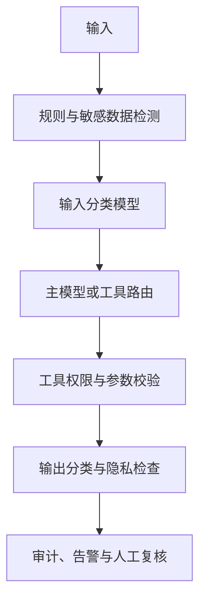
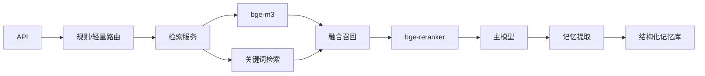
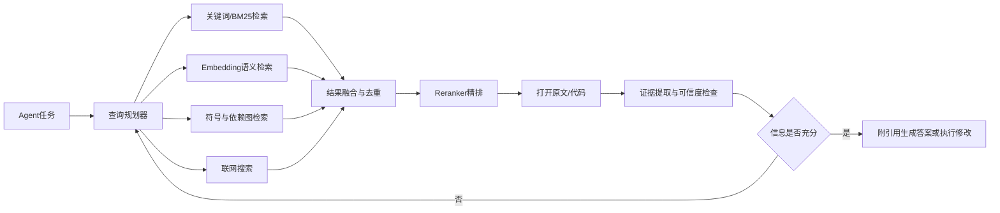
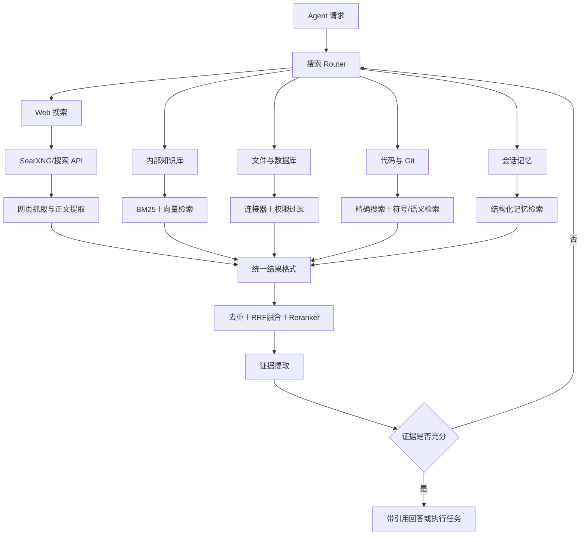

Embedding               检索 bge-m3
Reranker                排序 bge-reranker-large
router                  路由 Qwen/Qwen2.5-7B-Instruct 或 microsoft/Phi-4
记忆压缩 Context Relay   总结 Llama-3.2-3B 或 Qwen2.5-7B
Guard Model             安全 待定

为什么不用上面的开源模型？

### **完全可以用；是否采用这些开源模型，关键不在“能力够不够”，而在许可证、部署成本、中文效果、延迟和运维复杂度是否符合系统目标。**

你列出的方案本身很合理，尤其适合强调私有部署、数据不出域和成本可控的 RAG/Agent 系统。没有直接选用它们，通常有以下原因。

### **逐项来看**

| 模块 | 候选模型 | 适合之处 | 可能不采用的原因 |
|---|---|---|---|
| Embedding | bge-m3 | 中文、多语言和长文本能力较全面，支持稠密与多向量检索 | 输出和索引体积较大；混合检索链路更复杂；必须用真实语料调参 |
| Reranker | bge-reranker-large | 中文重排效果好，接入方式直接 | 逐对打分，候选数量一大就会显著增加 GPU 延迟 |
| Router | Qwen2.5-7B-Instruct / Phi-4 | 能理解复杂意图，可输出结构化路由结果 | 路由任务使用大模型可能过重、过慢；生成式输出也不如分类器稳定 |
| Context Relay | 3B/7B 指令模型 | 可私有化，对会话摘要和信息提取较灵活 | 摘要可能遗漏、篡改或合并事实；长期记忆需要更严格的数据结构和验证 |
| Guard Model | 待定 | 可以根据业务策略自建 | 这是风险最高的一环，通用开源模型通常不能直接等同于生产级安全系统 |

### **Embedding 和 Reranker：最值得优先采用**

`bge-m3 + bge-reranker-large` 是这份方案中最成熟、替换风险相对较低的组合。不过，“模型排行榜高”不代表它在业务数据上一定最优。检索系统真正需要测的是：

- Recall@K：正确文档能否进入候选集；
- MRR、NDCG：正确结果能否靠前；
- 中文简称、拼写错误和行业术语的召回表现；
- 长文档切块后的语义完整性；
- 单次查询延迟、吞吐和索引成本。

`bge-m3` 的优势不仅是普通向量检索，还包括更丰富的检索表示。但如果系统只使用单一稠密向量，可能没有充分利用它的能力；如果把稀疏、多向量等能力都接入，又会增加索引、融合排序和参数调优的复杂度。

`bge-reranker-large` 通常能提高最终排序质量，但它的开销与“查询数 × 候选文档数”相关。比如每次召回 100 个段落，就需要对 100 个查询—段落对进行交叉编码。因此生产环境常采用分层漏斗：


也就是说，不是不该用，而是不宜让大型 Reranker 直接处理过多候选项。

### **Router：7B 模型往往有些“用力过猛”**

路由一般要完成的是有限类别判断，例如：

- 是否需要检索；
- 使用哪个知识库；
- 是否调用工具；
- 是否需要读取长期记忆；
- 请求属于问答、写作还是操作任务。

如果类别固定、边界明确，规则、传统分类器或更小的模型往往更快、更稳定。用 7B 生成模型做路由会带来几个问题：首 Token 延迟较高、输出格式偶尔漂移、同一输入可能产生不同判断，而且每个请求都要额外进行一次推理。

但如果路由涉及多意图分解、复杂上下文判断和动态工具选择，Qwen2.5-7B-Instruct 这类模型就有明显价值。比较稳妥的方式是“分级路由”：

1. 规则处理确定性场景；
2. 小型分类器处理常见意图；
3. 只有低置信度或复杂请求才交给 7B 模型；
4. 路由结果使用 JSON Schema 或枚举约束；
5. 对高风险操作再做一次独立校验。

另外，不能只看参数量选择 Qwen2.5-7B-Instruct 或 Phi-4。还要比较中文理解、函数调用、结构化输出、量化后的精度下降、推理框架支持，以及具体模型版本的许可证。

### **Context Relay：难点是记忆可靠性，而不是摘要能力**

用 3B 或 7B 模型压缩上下文是可行的，但“把聊天总结成一段话”不等于建立了可靠记忆。自由文本摘要容易出现：

- 用户只是讨论某个偏好，模型却把它写成确定偏好；
- 临时计划被保存成长期事实；
- 否定词、时间和条件被压缩掉；
- 新旧信息冲突时错误覆盖；
- 多轮压缩后产生语义漂移。

因此 Context Relay 更适合输出结构化记忆，而不是只有一段自然语言总结。例如：

```json
{
  "stable_facts": [],
  "preferences": [],
  "active_tasks": [],
  "decisions": [],
  "open_questions": [],
  "constraints": [],
  "source_turns": [],
  "confidence": 0.0,
  "expires_at": null
}
```

在这个结构上，还应增加“写入、更新、冲突、过期和删除”规则。模型负责提取候选记忆，程序负责校验和版本管理。对于重要事实，保留原始消息引用或可追溯标识，避免仅依赖压缩后的文本。

Llama-3.2-3B 的资源需求较低，适合吞吐优先的摘要；Qwen2.5-7B 通常更适合中文、多条件提取和复杂指令遵循。最终仍应以中文会话数据集测试事实保留率、否定信息保留率、冲突识别率和压缩比。

### **Guard Model：不能只靠一个通用开源模型**

安全模块迟迟“待定”通常不是找不到开源模型，而是安全能力很难由单模型完整承担。Guard Model 可能误拒绝正常请求，也可能漏掉经过改写、编码或上下文包装的风险内容；业务自身还可能有隐私、权限、数据出域和合规要求。

更可靠的设计是多层防护：



Guard Model 只是其中一层。涉及账户、写操作、外部发送或高权限工具时，还需要白名单、最小权限、参数约束、用户确认和审计记录。开源模型可以参与分类，但不能替代完整的安全工程。

### **真正阻碍落地的通常是工程成本**

开源模型权重可以自行部署，但“权重可用”不等于“系统成本低”。实际成本还包括：

- GPU 采购或租赁、显存冗余和峰值容量；
- 推理服务、量化、批处理、缓存和监控；
- 模型升级、回归测试及灰度发布；
- 故障恢复和高可用；
- 模型及依赖组件的许可证审查；
- 业务数据集构建和持续评测；
- 多模型串联造成的累计延迟。

你的链路如果每次都依次调用 Embedding、Reranker、Router、Context Relay、Guard 和主模型，端到端延迟可能比任何单个模型的延迟明显更高。所以需要避免“每个请求都走完整链路”，而应按请求特征选择性启用。

### **比较合理的落地顺序**

建议先采用 `bge-m3 + bge-reranker-large` 建立检索基线，因为这两个模块的输入输出明确，也最容易离线评估。随后增加分级 Router，把规则和小模型放在前面，7B 模型只处理复杂请求。Context Relay 应先定义记忆数据结构和更新规则，再决定用 3B 还是 7B。Guard 则从规则、权限和审计开始，模型分类只是补充。

最终决策不应是笼统地问“开源模型能不能用”，而应该针对每个模块设置准入指标，例如检索 NDCG、路由准确率、摘要事实保留率、安全漏检率、P95 延迟、峰值吞吐和单请求成本。达到指标就采用，达不到就替换或做混合架构。

你推荐的都是github上的混合项目？这两者哪种更好？

### **不是。你列的是一组可独立部署的开源模型，而“GitHub 混合项目”通常是把检索、重排、路由、记忆和安全等组件封装成完整框架。没有绝对优劣：要快速验证选混合项目，要长期生产可控则选模块化模型组合。**

这里的“两者”可以理解为：

1. **模型组件方案**：自行组合 bge-m3、bge-reranker、Qwen、Llama 等模型。
2. **GitHub 混合项目方案**：采用已集成 RAG、Agent、记忆、路由等功能的开源框架或应用，再替换其底层模型。

### **核心区别**

| 维度 | GitHub 混合项目 | 自组开源模型 |
|---|---|---|
| 上手速度 | 快，通常已有界面和流程 | 慢，需要自行开发链路 |
| 定制能力 | 受框架抽象限制 | 很强，各模块都能替换 |
| 初期成本 | 较低 | 较高 |
| 长期维护 | 依赖社区和项目架构 | 由自己完全负责 |
| 性能优化 | 通用配置，未必适合业务 | 可针对延迟、显存和吞吐优化 |
| 故障定位 | 链路封装较深 | 模块边界清楚，更容易追踪 |
| 升级风险 | 上游升级可能造成兼容问题 | 可以独立升级某个模型 |
| 生产可控性 | 取决于项目质量 | 通常更高，但工程要求也更高 |

### **为什么它们不只是“GitHub 项目”**

`bge-m3`、`bge-reranker-large`、Qwen2.5-7B-Instruct 等首先是**模型及其权重**。代码仓库可能提供训练、推理和部署示例，但它们本身并不是一套完整应用。

而混合项目通常包含：

- 文档解析与切块；
- 向量数据库；
- Embedding 和 Reranker 接口；
- Prompt 编排；
- 模型路由；
- 对话历史和记忆；
- Agent 工具调用；
- API、管理后台与监控。

所以二者并非完全对立。更常见的组合是：**使用成熟框架承载工作流，在框架内部使用你列出的开源模型。**

### **什么时候混合项目更好**

如果你处在原型或内部试用阶段，想在几天内验证文档问答、知识库和 Agent 流程，成熟项目更合适。它能省掉大量基础工程工作，尤其是上传、解析、切块、索引、对话界面和模型适配。

但选择时不要只看收藏量，还要检查：

- 最近是否持续维护；
- 核心模块能否独立替换；
- 数据格式能否导出；
- 是否支持你准备使用的推理服务和向量数据库；
- 是否存在大量无法移除的强依赖；
- 许可证能否用于你的产品；
- 有没有测试、迁移脚本、监控和权限控制。

这种方案最大的风险是**框架锁定**：业务逻辑逐渐写进项目自己的节点、插件和数据格式，未来更换框架会很困难。

### **什么时候自组模型更好**

如果系统需要面向生产、高并发、严格延迟、私有数据或深度定制，自组方案更合适。你可以明确控制每一层：



这样的模块可以分别压测、扩容、替换。例如 Reranker 延迟过高时，只缩小重排候选集或替换重排模型，不需要改动整个系统。

代价

提高claudecode、hermes等agent搜索能力最好的方法是？

### **提升 Claude Code、Hermes 等 Agent 搜索能力，效果最好的不是换一个“大而全”的 GitHub 混合项目，而是建立“多路召回 + 查询规划 + Reranker + 证据反馈”的搜索闭环。代码搜索优先采用词法搜索、符号/依赖图与向量检索三路融合；联网搜索则采用搜索 API、页面抓取与证据验证。**

你前面列的 `bge-m3`、`bge-reranker-large`、Qwen 等是**模型组件**，不是 GitHub 混合项目。GitHub 项目通常只是把这些模型、索引库和 Agent 框架组装成可部署系统。两者不是二选一：

- 想快速验证：使用成熟项目搭建基线。
- 想追求质量、延迟和可控性：将模型组件接入自己的搜索服务。
- 实际生产中，通常是“项目做脚手架，组件按评测结果替换”。

### **最有效的搜索架构**



其中收益最大的通常是前三件事：**混合召回、精排、搜索迭代**。单独升级 Embedding，收益往往没有预期那么大。

### **代码库搜索与互联网搜索必须分开设计**

| 搜索场景 | 首选方法 | Embedding 的作用 | 最关键环节 |
|---|---|---|---|
| 精确代码定位 | ripgrep、文件名和路径搜索 | 辅助 | 保留标识符和错误原文 |
| 函数、类和调用关系 | AST、LSP、符号索引、依赖图 | 辅助 | 结构化代码关系 |
| “这段逻辑在哪里实现” | BM25 + 向量搜索 | 重要 | 混合召回与重排 |
| Git 历史与变更原因 | commit、diff、blame 搜索 | 辅助 | 时间与文件关联 |
| 文档和 Issue | 关键词 + 向量搜索 | 重要 | 元数据过滤 |
| 互联网资料 | 搜索 API + 页面抓取 | 可选 | 来源质量、时效与引用 |

对代码 Agent 而言，第一选择不应该是把整个仓库全部向量化。函数名、类名、配置键、错误码和文件路径都属于词法信号，纯向量检索很容易漏掉；调用关系和继承关系也无法仅靠文本相似度可靠还原。

### **推荐的模型与组件分工**

`bge-m3` 可用于文档、Issue、注释、README 以及语义代码块召回；`bge-reranker-large` 用于对初步召回的少量候选进行精排。Router 可用 7B 指令模型，但不要让它承担全部搜索工作。

建议让 Router 输出严格的搜索计划，例如：

```json
{
  "intent": "locate_implementation",
  "targets": ["authentication", "token refresh"],
  "exact_terms": ["refresh_token", "401", "expires_at"],
  "search_channels": ["lexical", "symbol", "semantic"],
  "path_filters": ["src/**", "packages/**"],
  "exclude": ["vendor/**", "dist/**"],
  "max_candidates": 50
}
```

搜索后先通过 RRF 等方法融合各通道排名，再让 Reranker 处理 Top 20～50，而不是让它比较整个仓库。精排结果还要保留来源路径、行号、符号名称和版本信息，避免 Agent 得到无法追溯的文本片段。

### **切块方式往往比 Embedding 型号更重要**

代码不要按固定 Token 长度机械切块。优先按函数、类、模块、配置段和文档标题切块，并给每个块附带：

- 仓库、分支与提交版本；
- 文件路径和语言；
- 符号名称与类型；
- 起止行号；
- import、调用者和被调用者；
- 测试文件与实现文件关系；
- 最近修改时间。

当命中一个函数时，应自动扩展它的签名、相邻类型定义、直接调用方、被调用函数和相关测试。这种“命中后上下文扩展”通常比简单增加 Top-K 更有效。

### **让 Agent 能够反思并重新搜索**

搜索能力强的 Agent 不会只查一次。建议强制采用以下循环：

1. 先提出搜索假设，并生成精确词、语义词及路径约束。
2. 并行运行关键词、符号和语义搜索。
3. 合并、去重并重排。
4. 打开原始文件验证，不直接相信摘要。
5. 判断当前证据能否支持结论。
6. 缺少定义、调用方、测试或版本信息时，生成下一轮查询。
7. 达到证据阈值后才回答或修改代码。

这里可以借助 Context Relay 保存“查过什么、排除了什么、还缺什么”，但应保存结构化搜索状态，而非反复压缩成模糊摘要：

```json
{
  "hypotheses": [],
  "queries_run": [],
  "files_verified": [],
  "evidence": [],
  "conflicts": [],
  "missing_information": [],
  "next_queries": []
}
```

### **如何接入 Claude Code、Hermes 一类 Agent**

最通用的方式是提供统一工具协议或本地搜索服务，而不是针对每个 Agent 重写检索逻辑。至少暴露以下工具：

```text
search_text(query, paths, regex, limit)
search_symbol(name, kind, scope)
find_references(symbol, depth)
search_semantic(query, filters, limit)
search_history(query, paths, time_range)
open_source(path, start_line, end_line)
search_web(query, domains, time_range)
fetch_page(url)
rerank(query, candidates)
```

工具返回结果必须短小、稳定且可验证。每条结果至少包含 `source`、`path/url`、`line_range`、`symbol`、`revision`、`score` 和简短片段。不要把几十个完整文件直接塞入上下文。

### **两种实施方式怎么选**

**现成 GitHub 混合项目**适合一两周内做出原型，优势是接入快；缺点是检索策略、数据格式和模型链路可能被框架绑定，复杂仓库上的效果不一定稳定。

**自建薄搜索层**更适合长期使用：底层复用成熟搜索引擎、AST/LSP 工具和模型服务，只自行维护查询规划、结果融合、上下文扩展与评测。它不是从零重写搜索引擎，而是把核心控制权留在自己手中。

因此，更推荐：**先用现成项目验证接口和数据流，再逐步抽出一个独立的薄搜索服务**。Agent 只依赖统一工具接口，底层的 `bge-m3`、Reranker、关键词引擎和符号索引都可以随时替换。

### **按收益排序的实施路线**

1. 先接入 `ripgrep + 文件读取 + Git 搜索`，并要求结果带行号和提交版本。
2. 增加 AST/LSP 符号索引、引用关系和测试关联。
3. 增加 BM25 与 `bge-m3` 混合召回。
4. 使用 RRF 合并排名，再由 `bge-reranker-large` 精排少量候选。
5. 增加“证据不足则重新搜索”的 Agent 循环。
6. 建立真实任务评测集，记录 Recall@K、定位成功率、最终任务完成率、P95 延迟和 Token 消耗。
7. 最后再优化 Router 和 Context Relay；它们不是第一阶段的主要瓶颈。

最终指标不要只看检索分数。对代码 Agent，最重要的是：**能否找到正确文件和行号、能否识别调用链、能否基于证据完成修改并通过测试**。这比单纯比较某个 Embedding 模型的排行榜成绩更有意义。

大神们使用什么方法来提升？

### **高手提升 Agent 搜索能力，通常不是堆更多模型，而是把搜索做成可验证的工程闭环：先用高信息量工具定位，再沿代码关系扩展，最后读取原文、运行测试并根据失败继续搜索。**

以 Claude Code、Hermes 这类编码 Agent 为例，业内实践大致集中在下面几种方法。

### **1. 先强化原生工具，而非先上向量数据库**

高手最常使用的基础组合是：

- `rg`/grep：搜索标识符、错误信息、配置项和日志文本；
- `find`/文件 glob：按目录、扩展名和命名规律缩小范围；
- Git：搜索提交、diff、blame 和改动历史；
- AST、LSP：查定义、引用、实现、继承及调用关系；
- 测试、编译器、类型检查器：验证搜索得到的判断。

原因很简单：代码含有大量精确符号。函数名、异常文本、环境变量、API 路径等，词法搜索通常比 Embedding 更快、更准，也更容易追溯。

### **2. 使用“渐进披露”，不把整个仓库灌入上下文**

常见流程是先建立仓库地图，只保留目录、关键文件、公共符号和模块关系；确定目标后，再逐层读取：


这样既节省 Token，也减少无关代码对模型判断的干扰。单纯扩大上下文窗口，并不等于搜索能力提高。

### **3. 采用“搜索漏斗”而非一次检索**

成熟流程一般分为三层：

1. **高召回**：并行运行关键词、路径、符号和语义检索，宁可多找到一些候选。
2. **高精度**：依据路径、语言、符号类型、更新时间和 Reranker 缩小范围。
3. **原文验证**：打开源文件及测试，确认实现、引用和版本。

典型配置可以是：

```text
词法/符号/语义召回：各取 Top 20～50
融合去重：保留 Top 30
Reranker：精排 Top 10～20
Agent 实际读取：Top 3～8
```

这比直接让一个 7B 模型在大量结果中挑答案更稳定。

### **4. 搜索前先做 Query Expansion**

高手会让 Agent 把自然语言任务转换成多种检索信号，而不是原句直接搜索。例如，“登录偶尔失效”可以展开成：

- 业务词：登录、会话、令牌刷新；
- 标识符：`refresh_token`、`expires_at`、`session_id`；
- 错误信号：`401`、`unauthorized`、`token expired`；
- 结构信号：认证中间件、HTTP 客户端、缓存模块；
- 历史信号：最近有关 auth/session 的提交；
- 测试信号：认证、过期、并发刷新测试。

尤其重要的是保留错误原文、堆栈中的函数名和文件名，这些往往是最强的检索锚点。

### **5. 命中代码后沿关系图扩展**

搜索到一个函数不代表找到了原因。高手通常继续查看：

- 定义和所有调用方；
- 上游输入与下游副作用；
- 接口及其实现类；
- 对应测试和 mock；
- 配置、环境变量与 feature flag；
- 近期修改该区域的提交；
- 同类实现或旧实现。

所以，AST/LSP/调用图经常比单纯换 Embedding 模型更能提高真实任务成功率。

### **6. 强制建立“假设—证据—验证”循环**

优秀 Agent 不会根据第一个搜索结果就开始改代码。它会维护简洁的工作状态：

```json
{
  "task": "定位令牌刷新失败原因",
  "hypotheses": [
    "并发请求重复刷新",
    "过期时间单位错误"
  ],
  "verified_files": [],
  "supporting_evidence": [],
  "contradictions": [],
  "missing_evidence": [
    "刷新函数的所有调用方",
    "并发测试"
  ],
  "next_actions": []
}
```

每轮搜索后判断：证据是否支持假设？是否存在反例？还缺哪些定义、调用方或测试？然后生成下一轮查询。Context Relay 最适合压缩这种结构化状态，而不是把全部过程写成一段摘要。

### **7. 把编译器和测试当作搜索工具**

这是编码高手与普通聊天式 Agent 的显著区别。修改之后，他们会根据反馈继续定位：

- 编译错误揭示类型、接口和依赖关系；
- 测试失败揭示行为约束；
- Linter 揭示隐含规范；
- 堆栈跟踪指向真实执行路径；
- 覆盖率显示相关代码是否实际运行；
- `git diff` 检查是否发生了无关修改。

也就是说，执行反馈本身就是下一轮搜索查询的来源。静态搜索与动态验证结合，通常比继续增加召回数量更有效。

### **8. 对互联网搜索采用“原始来源优先”**

查库版本、API 和兼容性问题时，常见优先级是：

1. 当前项目锁文件与本地类型定义；
2. 官方文档和版本说明；
3. 上游源码、Issue 与变更记录；
4. 其他二手文章。

还会把包名、精确版本、错误原文和运行环境放进查询，并核对发布日期与适用版本。搜索摘要只用于发现页面，最终判断必须回到原始内容。

### **9. 用子 Agent 并行探索，但控制边界**

复杂任务中，可以按假设或信息源拆分，例如：

- 一个 Agent 查代码定义和引用；
- 一个查测试及失败路径；
- 一个查 Git 历史；
- 一个查依赖文档。

主 Agent 只接收结构化结果：结论、证据位置、置信度、未解决问题。并行的价值在于减少等待时间和扩大假设覆盖；如果没有明确分工，多个 Agent 反而会重复搜索并消耗大量 Token。

### **10. 用真实任务做回归评测**

高手不会仅凭“感觉变聪明了”判断优化效果，而会保存一批真实任务，例如定位 Bug、追踪调用链、解释模块、完成跨文件修改。重点测量：

| 指标 | 说明 |
|---|---|
| File Recall@K | 正确文件是否进入前 K 个结果 |
| Symbol Recall@K | 正确函数或类是否被召回 |
| Evidence Precision | Agent 打开的内容中有多少真正相关 |
| Task Success Rate | 最终修改能否通过测试 |
| Search Rounds | 完成任务需要几轮搜索 |
| Token/P95 延迟 | 成本及最慢请求体验 |

每次更换切块方式、Embedding、Reranker 或 Prompt，都在同一任务集上回放。很多情况下，改进工具描述、查询扩展、代码切块和结果格式，比升级模型更有收益。

### **最实用的优先顺序**

如果现在要提升现有 Agent，建议依次做：

1. 完善 `rg`、文件 glob、Git 和源码读取工具；
2. 增加 AST/LSP 的定义、引用及实现查询；
3. 要求每个结论携带文件路径、行号和版本；
4. 加入证据不足时自动再次搜索的循环；
5. 再做 BM25 与 `bge-m3` 混合召回；
6. 对少量候选使用 `bge-reranker-large`；
7. 最后才优化 Router、记忆压缩和多 Agent 并行。

真正拉开差距的通常不是“用了哪个明星模型”，而是**精确工具、仓库结构认知、关系扩展、原文证据以及测试反馈**这五项是否连成闭环。

有做的好的开源项目吗？

### **有。面向 Claude Code、Hermes 等编码 Agent，我最推荐先试 `grepai`；想要更完整的混合语义检索，选 `claude-context`；超大仓库和多仓库精确搜索则用 `Zoekt` 打底。不要一开始就部署通用 RAG 平台。**

截至 2026 年 7 月，值得重点评估的项目如下。

| 项目 | 核心能力 | 最适合 | 主要不足 |
|---|---|---|---|
| `grepai` | 本地语义搜索、调用图、文件监听、MCP | 个人或团队本地代码 Agent | 规模和成熟度仍需实测 |
| `claude-context` | BM25＋向量混合检索、AST 切块、增量索引、MCP | 大型代码库语义搜索 | 后端和部署相对更重 |
| `Zoekt` | 极快的字符串、正则和跨仓库检索 | 超大仓库、精确代码搜索 | 不提供完整语义 RAG |
| `OpenGrok` | 搜索、源码浏览、交叉引用 | 团队内部代码门户 | Agent 接口需要自行包装 |
| `RAGFlow` | 文档解析、RAG 流程和 Agent 能力 | 代码之外还有大量文档 | 对纯代码搜索偏重 |

### **首选：grepai**

[grepai](https://github.com/yoanbernabeu/grepai) 是目前与你的需求贴合度最高的轻量方案。它直接面向 AI Agent，提供：

- 自然语言语义代码搜索；
- 调用者、被调用者和调用图追踪；
- MCP 服务，可接入支持 MCP 的编码 Agent；
- 文件监听和增量更新；
- 默认支持本地 Embedding，代码可不离开机器；
- 紧凑结果模式，先返回文件和位置，再让 Agent 按需读取源码。

这比普通“向量化整个仓库”的项目更实用，因为调用关系对修改代码非常重要。它还支持 Ollama、LM Studio 等本地推理方式，但默认 Embedding 对中文查询未必最优；中文仓库应测试模型替换和中英文查询扩展效果。[GitHub](https://github.com/yoanbernabeu/grepai)

适用情形：你想快速给 Claude Code、Hermes 或其他支持 MCP 的 Agent 增加搜索能力，同时希望本地部署、依赖少、改造成本低。

### **第二选择：claude-context**

[claude-context](https://github.com/zilliztech/claude-context) 更像一个完整的代码检索基础设施。它提供：

- BM25 与稠密向量混合检索；
- 基于 AST 的代码切块；
- 基于 Merkle Tree 的增量索引；
- 按扩展名过滤；
- MCP 工具，包括索引、搜索、状态和清除索引；
- 可配置 Embedding 模型及向量存储后端。

它比纯向量方案更合理，因为函数名、错误码和配置键适合 BM25，而“认证流程在哪里实现”适合语义检索。缺点是组件更多，部署、索引状态、向量库和模型配置都需要维护。[GitHub](https://github.com/zilliztech/claude-context/blob/master/packages/mcp/README.md)

适用情形：仓库较大、自然语言搜索很多，而且你愿意维护较完整的索引服务。

### **大型代码库底座：Zoekt**

[Zoekt](https://github.com/sourcegraph/zoekt) 不是 RAG 项目，而是专门为源代码设计的高速搜索引擎。它支持：

- 字符串、子串和正则表达式；
- 布尔查询；
- 文件、语言、仓库和分支过滤；
- 单仓库与跨仓库搜索；
- 基于符号等代码信号进行排序；
- 索引服务、Web 服务和 API。

它特别适合精确检索：异常原文、函数名、API 路径、配置键和跨仓库依赖。缺点是没有直接解决自然语言语义检索与 Agent 上下文编排，需要自行封装 MCP，并在上层增加 Embedding 和 Reranker。[GitHub](https://github.com/sourcegraph/zoekt/blob/main/README.md)

适用情形：大型 monorepo、上百个仓库，或者精确搜索的速度和召回率比部署简单更重要。

### **OpenGrok：更适合人和 Agent 共用**

[OpenGrok](https://github.com/oracle/opengrok) 是成熟的源码搜索与交叉引用平台。它适合搭建公司内部代码门户，让开发者浏览源码、查看符号关系并搜索历史代码。

它的主要问题是 Agent-native 程度不足。若要给 Claude Code 或 Hermes 使用，通常需要把搜索、符号跳转和源码读取 API 包装成 MCP 工具。因此它适合已经部署 OpenGrok 的组织，不一定适合从零建设 Agent 搜索。

### **RAGFlow：适合“代码＋文档”，不建议只为代码部署**

[RAGFlow](https://github.com/infiniflow/ragflow) 是通用 RAG 与 Agent 平台，适合统一处理设计文档、接口规范、PDF、知识库、工单及部分代码内容。它的文档解析、检索流程和可视化管理更完整，但不能代替 AST、LSP、调用图和精确代码搜索。

如果你的目标只是让编码 Agent 找函数和调用链，部署它往往过重；如果需要同时检索代码、产品文档、数据库说明和内部知识库，它才更有价值。[GitHub](https://github.com/topics/rag)

### **我的实际推荐组合**

对于个人或中小型仓库，直接采用：

```text
ripgrep/原生 Grep
        +
grepai MCP
        +
Agent 自带文件读取、Git、测试工具
```

其中，精确标识符继续交给 `rg`，自然语言查询和调用图交给 `grepai`。不要让语义搜索替代精确搜索。

对于中大型仓库，采用：

```text
rg/Zoekt 精确召回
        +
claude-context 混合语义召回
        +
bge-reranker 精排
        +
MCP 统一接口
```

这套方案的效果上限更高，但工程成本也明显增加。Reranker 只应处理融合后的 Top 20～50，避免拖慢每次 Agent 调用。

如果只能选择一个开源项目，我会这样选：

- **最快改善 Claude Code/Hermes：`grepai`**
- **更完整的混合语义检索：`claude-context`**
- **超大规模精确搜索：`Zoekt`**
- **代码与大量企业文档统一检索：`RAGFlow`**

最稳妥的起点是 `grepai + rg`。先用十几个真实任务评测“正确文件命中率、调用链定位率、Token 消耗和任务完成率”，确认语义搜索确实提高成功率后，再考虑引入 `claude-context`、独立 Reranker 或更重的通用 RAG 平台。

不仅仅是代码搜索啊，是agent通用的搜索工具。

### **明白，你需要的是 Agent 的“统一检索基础设施”，覆盖公网、本地文件、知识库、数据库、代码和历史记忆，而不只是代码搜索。开源项目中，`GPT Researcher` 和 `Open Deep Research`适合直接使用；自建通用搜索工具，则更推荐“统一 MCP 接口＋多数据源适配器＋混合检索与验证层”，而不是寻找一个包打天下的项目。**

上一条把范围限得太窄了。通用 Agent 搜索实际包含两个不同层次：

- **搜索工具层**：提供搜索网页、读取页面、检索文件、数据库和记忆的能力。
- **研究 Agent 层**：规划查询、并行搜索、阅读原文、发现信息缺口、再次搜索，最后引用证据回答。

一个项目通常只擅长其中一层。

### **目前值得看的开源项目**

| 项目 | 定位 | 搜索范围 | 推荐用途 |
|---|---|---|---|
| GPT Researcher | 完整研究 Agent | Web＋本地资料 | 最快获得通用深度搜索能力 |
| Open Deep Research | 可改造研究工作流 | 多种搜索提供商 | 自建搜索策略和评测 |
| SearXNG | 自托管元搜索引擎 | 公网 | 通用 Web 搜索底座 |
| Firecrawl | 搜索、抓取和站点爬取 | 公网网页、PDF | 把网页转成 Agent 可读内容 |
| RAGFlow | 企业知识检索平台 | 文件、知识库 | 内部文档与结构化知识检索 |
| Haystack | 检索流水线框架 | 文档、数据库、Web 连接器 | 自建可控的企业搜索服务 |
| LlamaIndex | 数据连接与检索编排 | 文件、数据库、API | 快速连接多类数据源 |

### **直接使用：GPT Researcher**

[GPT Researcher](https://github.com/assafelovic/gpt-researcher) 比单纯的搜索 MCP 更接近你要的“通用搜索 Agent”。它采用 Planner 与执行 Agent 分工，能够：

- 分解研究问题；
- 生成多个搜索查询；
- 并行收集网页和本地资料；
- 维持研究上下文；
- 聚合多个来源；
- 生成带来源的长报告；
- 输出 PDF、Word 等格式。

它适合“调查一个市场、比较产品、研究技术方案、搜索资料并形成结论”这类任务。缺点是整体偏向**研究报告生成器**，对于 Agent 每一步都要调用的低延迟搜索工具来说偏重；查询一次可能触发大量搜索、网页抓取和模型推理。[GitHub](https://github.com/assafelovic/gpt-researcher/blob/main/README.md)

因此它适合被暴露成一个高级工具：

```text
deep_research(question, scope, freshness, budget)
```

但不应替代基础的 `search_web` 和 `fetch_page`。

### **方便二次开发：Open Deep Research**

[Open Deep Research](https://github.com/langchain-ai/open_deep_research) 更适合研究工作流实验与二次开发。它把搜索、研究、压缩和报告生成拆成较清晰的流程，可配置模型和搜索提供商。

适合以下需求：

- 自己控制搜索轮数和预算；
- 替换搜索引擎；
- 加入企业内部资料；
- 增加来源评分和事实验证；
- 研究过程需要可观测、可回放；
- 想对 Router、Context Relay 或研究策略进行实验。

它更像一个可改造的“Agentic Search 参考实现”，而不是安装后就能覆盖全部企业数据源的统一搜索服务器。[GitHub](https://github.com/langchain-ai/open_deep_research)

### **公网检索底座：SearXNG**

[SearXNG](https://github.com/searxng/searxng) 是自托管元搜索引擎，可以汇聚多个搜索来源，不跟踪或画像用户，适合需要隐私和自主管理的场景。[GitHub](https://github.com/searxng/searxng/blob/master/README.rst)

它只能解决“发现网页”，不能完整解决：

- JavaScript 页面读取；
- 正文清洗；
- PDF 解析；
- 搜索结果精排；
- 来源可信度判断；
- 递归研究；
- 答案引用。

因此比较合理的链路是：

```text
SearXNG 搜索候选网页
      ↓
网页读取/抓取服务提取正文
      ↓
Reranker 选出真正相关页面
      ↓
Agent 阅读原文并提取证据
```

SearXNG 适合私有化和低成本，但公共搜索源可能存在限流、验证码和结果波动。因此生产环境通常还会配置第二搜索供应商作为降级通道。

### **网页读取：Firecrawl 一类项目**

搜索 API 通常只返回标题、URL 和短摘要。Agent 要形成可靠答案，还必须读取页面原文。此时需要网页抓取和正文解析层，例如 [Firecrawl](https://github.com/mendableai/firecrawl)。

这类工具负责：

- 搜索和抓取网页；
- 处理部分动态页面；
- 将 HTML 清洗为 Markdown；
- 遍历网站；
- 提取结构化字段；
- 处理部分 PDF 和复杂网页。

它解决的是“搜到之后如何读”，不是内部知识库检索。自托管版本和托管服务在功能、稳定性及运维成本上可能不同，选型时要分别验证。

### **内部知识：RAGFlow、Haystack 和 LlamaIndex**

如果“通用搜索”还包括 PDF、Word、邮件、Wiki、业务文档和数据库，需要另一套内部检索层。

[RAGFlow](https://github.com/infiniflow/ragflow) 偏向完整平台：文档解析、知识库、检索流程和可视化管理较齐全。适合希望较快搭建企业知识检索系统，但会比较重。

[Haystack](https://github.com/deepset-ai/haystack) 更偏检索管线。它适合把 BM25、向量检索、过滤、Reranker 和生成模型连接成可控服务，对生产工程和自定义流程更友好。

[LlamaIndex](https://github.com/run-llama/llama_index) 强项是数据连接与索引编排，适合快速连接文件、数据库、API 和其他数据源，但复杂生产系统仍需自行完善权限、增量更新、评测和可观测性。

三者不是简单的好坏关系：

- 要开箱即用的平台：RAGFlow；
- 要清晰可控的检索流水线：Haystack；
- 要丰富连接器和快速开发：LlamaIndex。

### **通用 Agent 最合理的工具接口**

与其只给 Agent 一个模糊的 `search()`，更好的方式是暴露一组职责明确的工具：

```text
search_web(query, freshness, domains, language, limit)
fetch_url(url, render_js, extract_mode)
crawl_site(url, depth, limit)

search_knowledge(query, collections, filters, limit)
search_files(query, paths, file_types, limit)
search_database(query, datasource, schema_scope)
search_code(query, repositories, mode, limit)
search_memory(query, time_range, limit)

rerank(query, candidates, limit)
verify_claim(claim, evidence)
deep_research(question, scope, budget)
```

Agent 可以根据任务选择数据源，普通问题走单轮搜索，复杂问题才进入深度研究，避免每次请求都启动昂贵的多 Agent 流程。

### **推荐架构**



所有搜索后端最好统一返回：

```json
{
  "source_type": "web",
  "title": "页面标题",
  "uri": "来源地址",
  "content": "相关正文",
  "published_at": null,
  "retrieved_at": "2026-07-11T12:57:59",
  "score": 0.87,
  "authority": 0.8,
  "freshness": 0.9,
  "permissions": [],
  "metadata": {}
}
```

这使 Router、融合排序、证据验证和引用输出不需要了解每个底层项目的私有格式。

### **针对 Claude Code、Hermes 的实际选择**

如果你希望**立刻提高通用联网研究能力**，可以从以下组合开始：

```text
SearXNG
＋
Firecrawl
＋
GPT Researcher
＋
统一 MCP 包装
```

分工是：

- SearXNG：发现网页；
- Firecrawl：读取网页；
- GPT Researcher：规划和递归研究；
- MCP：让不同 Agent 使用同一组工具。

如果还需要私有文件和企业知识：

```text
SearXNG＋Firecrawl
＋
Haystack 或 RAGFlow
＋
GPT Researcher/Open Deep Research
＋
统一 MCP
```

如果更注重可控、可替换和长期维护，我会选择：

```text
Web：SearXNG＋网页读取器
内部检索：Haystack
深度研究：Open Deep Research
接口：MCP
模型：bge-m3＋bge-reranker-large
```

其中 `bge-m3` 主要用于内部文档和已抓取内容的语义检索；它不应替代公网搜索引擎。`bge-reranker-large` 用于对不同渠道返回的小批候选进行统一精排。Router 决定搜索哪里，Context Relay 保存搜索计划、已读来源、证据冲突和待解决问题。

真正通用而且效果好的方案，不是一个 GitHub 项目，而是**搜索源、内容读取、内部检索、深度研究和证据验证五层组合**。现成项目用于填充每一层，统一接口和评测体系则由你控制。

个人使用推荐什么样的组合？

### **个人使用建议从轻量组合开始：Agent 自带搜索或一个稳定的搜索 API＋网页正文提取＋本地知识检索；只有复杂调查才调用 Open Deep Research。若优先隐私和零调用费，再把搜索 API 换成自托管 SearXNG。**

## **我最推荐的个人组合**

```text
日常公网搜索：一个稳定的 Web Search API
网页阅读：Crawl4AI 或 Agent 自带 fetch/browser
本地资料：轻量 BM25＋向量检索
深度调查：Open Deep Research，按需启动
统一接入：MCP
```

这个方案比 `SearXNG＋Firecrawl＋RAGFlow＋GPT Researcher` 全家桶更适合个人。后者服务太多，更新、监控和排障成本很可能超过实际收益。

| 层级 | 推荐选择 | 是否必须 |
|---|---|---|
| Web 发现 | Agent 原生搜索或稳定搜索 API | 必须 |
| 网页正文 | Crawl4AI／原生 fetch | 必须 |
| 本地文件 | Qdrant/SQLite 向量索引＋BM25 | 有资料库再加 |
| 重排 | bge-reranker-base/large | 初期可不加 |
| 深度研究 | Open Deep Research | 按需 |
| 接口 | MCP | 多个 Agent 共用时需要 |
| 代码搜索 | `rg`＋可选 grepai | 经常编程才加 |

### **为什么日常搜索优先用 API**

个人日常搜索更看重稳定、低延迟和少维护。搜索 API 通常能直接返回标题、URL、摘要和时间信息，Agent 接入也简单。个人每月调用量不高时，免费额度或小额套餐往往比维护元搜索服务划算。

搜索和网页读取要分开：搜索结果摘要只用于发现页面，重要结论仍应通过 `fetch_url` 打开原文。网页读取层可使用 Agent 自带浏览器；没有可靠读取工具时，再部署 [Crawl4AI](https://github.com/unclecode/crawl4ai) 或同类正文提取服务。

### **隐私优先时换成 SearXNG**

如果你不希望搜索词交给单一搜索服务，或者调用量较大，可以自托管 [SearXNG](https://github.com/searxng/searxng)。它负责发现网页，再由 Crawl4AI 提取正文。

```text
Agent
  ├─ search_web → SearXNG
  ├─ fetch_url  → Crawl4AI
  └─ research   → Open Deep Research
```

但要注意：SearXNG 聚合上游来源，并不意味着搜索完全不受上游限流影响；部分来源可能出现验证码、失效或结果波动。个人部署时只启用少数稳定来源即可，不要盲目开启所有引擎。

另外，旧的独立 `searxng-docker` 仓库已在 2026 年 3 月归档，新安装应采用 SearXNG 主仓库当前的容器安装文档，不要照抄旧教程。[GitHub](https://github.com/searxng/searxng/blob/master/docs/admin/installation-docker.rst?plain=true)

### **深度搜索选 Open Deep Research**

[Open Deep Research](https://github.com/langchain-ai/open_deep_research) 支持多种模型、搜索工具和 MCP 服务，还能在本地启动研究流程。它适合产品调研、旅行规划、论文综述、购买决策和复杂技术选型。[GitHub](https://github.com/langchain-ai/open_deep_research)

但不要把每个普通问题都交给它。更合理的是两级模式：

- **普通搜索**：1～3 个查询，读取 3～5 个页面；
- **深度研究**：问题分解、并行查询、迭代阅读和交叉验证。

可以规定只有用户明确说“深入研究”，或者 Router 判断为多跳问题时，才调用 `deep_research`。这样能显著降低延迟和 Token 消耗。

### **本地知识库不要一开始上重型平台**

如果只是几百到几千份笔记、PDF 和 Markdown，没有必要一开始部署完整 RAG 平台。可以采用：

```text
解析：文本/Markdown/PDF 解析器
索引：SQLite FTS5 或轻量 BM25
向量库：Qdrant 本地模式或 LanceDB
Embedding：bge-m3
精排：先不启用，效果不足再加
```

对中文、多语言和长文档，`bge-m3` 是合理候选。切块应按标题、段落和文档结构进行，并保存文件名、章节、页码、修改时间及来源。对于个人资料，元数据和切块质量通常比换更大的 Embedding 模型更重要。

当候选结果经常“相关但不准确”时，再加入 `bge-reranker-large`。如果机器资源有限，可先用较小的 Reranker，或者只对 Top 10～20 候选精排。

## **按设备和维护意愿选择**

### **方案 A：最省心，适合绝大多数个人**

```text
现有 Agent
＋
Web Search API
＋
Agent 自带网页读取
＋
Open Deep Research（可选）
```

优点是安装少、稳定、很快能用。缺点是依赖外部服务，搜索和页面内容可能发送到第三方。

### **方案 B：隐私和低成本优先**

```text
现有 Agent
＋
SearXNG
＋
Crawl4AI
＋
本地 Embedding
＋
Open Deep Research
```

这套更自主，但需要 Docker、存储空间和持续维护。普通 CPU 可以运行 SearXNG 和抓取服务；本地 Embedding 的速度则取决于模型、文档规模和硬件。

### **方案 C：个人重度知识管理**

```text
SearXNG/搜索 API
＋
Crawl4AI
＋
Haystack
＋
Qdrant
＋
bge-m3
＋
bge-reranker
＋
Open Deep Research
```

只有在你拥有大量论文、笔记、网页存档和工作资料，并且确实需要跨来源统一检索时，这套才值得。否则 Haystack、向量库和模型服务会带来不必要的运维负担。

## **给 Agent 暴露的工具越少越好**

个人系统初期只需四个工具：

```text
search_web(query, freshness, domains, limit)
fetch_url(url, extract_mode)
search_local(query, filters, limit)
deep_research(question, budget)
```

让 `search_web` 只返回标题、URL、摘要和时间；让 `fetch_url` 返回清洗后的正文；`search_local` 负责个人资料；`deep_research` 才执行多轮规划。工具描述和返回格式保持简短，通常比给 Agent 安装十几个功能重叠的 MCP 更稳定。

## **落地顺序**

1. 先用搜索 API和现有网页读取能力，验证 Agent 是否真正会“搜索后打开原文”。
2. 加入 Open Deep Research，专门处理复杂问题。
3. 有本地资料需求时，再加 `bge-m3＋轻量向量库`。
4. 结果排序不理想时，加入 Reranker。
5. 只有搜索量、隐私需求或 API 成本明显上升时，才部署 SearXNG。
6. 经常处理动态网站、分页和结构化采集时，再加 Crawl4AI 或浏览器自动化。

因此，对个人用户最均衡的起点是：**一个可靠搜索 API＋现有网页读取器＋Open Deep Research；本地资料使用 bge-m3；SearXNG 和 Reranker都属于第二阶段。**

@omn-merge-bundle.md

我已看到 `omn-merge-bundle.md`。它是一套将 OmniRoute 3.8.43 部署到容器环境的完整配置，主要包括：

- 固定镜像版本与 Digest 的 `Dockerfile`
- OmniRoute、鉴权网关及 Litestream 的启动编排
- `/v1` 接口的 PSK 鉴权代理
- 多个模型密钥、模型分档与 Combo 路由的自动初始化
- 动态 RPM、并发量及请求间隔计算
- 模型存活检查与可选轻量探针
- 上下文窗口的日志观测和累积推荐
- SQLite 经 Litestream 备份到对象存储
- 配置快照及调试日志上传
- 首次初始化和增量初始化两套流程

就前面讨论的“个人 Agent 通用搜索组合”而言，这个文件目前主要承担的是**模型聚合、路由、限流、上下文压缩、记忆配置和持久化**，尚未直接提供完整的通用搜索能力。

比较合适的扩展方向是在现有 OmniRoute 外侧增加独立搜索层，而不是把搜索逻辑塞进 `init-nim-keys.sh`：

```text
Claude Code / Hermes / 其他 Agent
          │
          ├── 模型请求 → OmniRoute Gate
          │
          ├── search_web → 搜索 API 或 SearXNG
          │
          ├── fetch_url → Crawl4AI 或网页读取器
          │
          ├── search_local → 本地混合检索
          │
          └── deep_research → Open Deep Research
```

建议保持 OmniRoute 的职责单一：负责模型供应、路由、重试、限流、压缩与模型侧记忆；搜索服务则通过 MCP 或独立 HTTP API 提供。这样搜索后端可以单独升级、失败和重启，不会影响模型网关，也不会进一步放大当前入口脚本的复杂度。

搜索查证OmniRoute、nvidia nim，优化以上会话脚本配置。

### **搜索结果确认了几个关键事实，可用来进一步优化这份配置：OmniRoute 官方最新版本已到 3.8.46（存在 Turbopack 构建缺陷），脚本锁定 3.8.43 的做法是对的；NVIDIA NIM 免费层实质是“限速”而非纯粹信用点，40 RPM 是社区公认基线且不保证可申请提升；OmniRoute 本身已内置 `search-tools` 仪表盘页，可作为通用搜索层的现成入口，而不必额外自建。**

## **验证到的关键事实**

| 项目 | 核实结果 | 来源 |
|---|---|---|
| OmniRoute 版本 | 官方最新为 3.8.46；3.8.45+ 引入 Docker Turbopack 缓存问题，脚本注释里的判断准确 | [explainx.ai](https://explainx.ai/blog/omniroute-ai-gateway-free-llm-proxy-claude-code-2026) [jsdelivr](https://www.jsdelivr.com/package/npm/omniroute) |
| Combo 策略 | 官方文档确认 17 种公开策略（priority/weighted/round-robin/context-relay/fill-first/p2c/random/least-used/cost-optimized/reset-aware/reset-window/headroom/strict-random/auto/lkgp/context-optimized/fusion），`quota-share` 属内部策略，不在公开枚举中 | [GitHub Wiki](https://ithub.global.ssl.fastly.net/diegosouzapw/OmniRoute/wiki/cs%E2%80%90Architecture) [AUTO-COMBO.md](https://github.com/diegosouzapw/OmniRoute/blob/main/docs/routing/AUTO-COMBO.md) |
| NIM 免费层限速 | NVIDIA 官方口径是“限速依模型、场景和当前整体流量而定”，社区公认基线约 40 RPM/Key，且官方明确不受理提升请求 | [NVIDIA Developer Forums](https://forums.developer.nvidia.com/t/clarity-on-nim-api-free-tier-rate-limit-increases/369624) [decodethefuture.org](https://decodethefuture.org/en/nvidia-nim-api-pricing-limits-guide) |
| NIM 429 处理 | 官方建议：客户端指数退避＋抖动、遵循 `Retry-After`、限制并发、失败转移到第二模型/账号 | [decodethefuture.org](https://decodethefuture.org/en/nvidia-nim-api-pricing-limits-guide) |
| OmniRoute 已有搜索能力 | Dashboard 中存在 `/dashboard/search-tools`（搜索提供商测试与历史），说明搜索接入本就是 OmniRoute 的一等公民功能，不需要另起服务 | [GitHub Wiki](https://ithub.global.ssl.fastly.net/diegosouzapw/OmniRoute/wiki/cs%E2%80%90Architecture) |
| Context Relay | 官方特性，用于账号轮换时保留会话上下文，目前仅支持 Codex 账号轮换 | [FEATURES.md](https://github.com/diegosouzapw/OmniRoute/blob/main/docs/guides/FEATURES.md) |

## **针对脚本的具体优化建议**

### **1. RPM 推导公式偏乐观，应按模型分层而不是按 Key 数线性放大**

当前逻辑：

```sh
_PER_KEY_RPM=${NIM_PER_KEY_RPM:-35}
_RPM=$(( _ALIVE_KEYS * _PER_KEY_RPM ))
```

官方确认限速“依模型而定”，重模型（`kimi-k2.6`、`minimax-m2.7`、`mistral-large-3-675b`）实际吞吐往往明显低于 `llama-3.3-70b` 这类轻模型。建议按分档给不同 RPM 上限，例如给 `TIER_RESTRICTED` 单独设置更低的每 Key RPM 系数，而不是所有模型共用 35。这能减少大模型频繁 429 触发熔断和上下文累积表里出现大量“假失败”。

### **2. 429 判定逻辑已经正确，但退避策略仍缺失**

脚本的 `context_accumulator_update` 里已经正确地把 401/403/429 排除在失败统计外，避免污染 `first_failure_tokens`——这是对的，符合官方“429 是限速信号，不是能力边界信号”的定性。但 `entrypoint.sh` 和 `init-nim-keys.sh` 本身没有为 429 增加指数退避+`Retry-After`逻辑，目前完全依赖 OmniRoute 内部路由处理。建议在 `_MIN_INTERVAL_MS` 计算之外，额外为探针 `nim_probe` 和模型健康检查 `check_nim_model_health` 的 HTTP 调用加入简单重试与抖动，因为这些请求直接打 NVIDIA API，不经过 OmniRoute 的重试机制。

### **3. 版本护栏可以更严格，避免静默漂移到 3.8.46**

当前 `EXPECTED_OR_VERSION` 只做告警不阻断：

```sh
if [ "$_OR_VER" != "$EXPECTED_OR_VERSION" ] && [ "$_OR_VER" != "unknown" ]; then
  echo "[entrypoint] ⚠️ WARN: 版本($_OR_VER)与期望($EXPECTED_OR_VERSION)不一致——疑似 FROM 漂移。"
fi
```

鉴于 3.8.45+ 确实存在已知的 Turbopack 缓存 mmap 失败问题（Dockerfile 注释中已提到根因），可以考虑把这一检查升级为“连续失败 N 次健康检查则退出容器”，而不仅仅是打印告警，防止版本漂移导致的静默 hang 被长期忽略。

### **4. 建议直接用 OmniRoute 自带的 search-tools，而不是外部叠加搜索服务**

前几轮讨论建议的“独立搜索层（SearXNG/Firecrawl/MCP）”仍然成立，但既然 OmniRoute 本身在 Dashboard 里已经暴露了 `search-tools` 页面用于搜索提供商测试和历史记录，更合理的路径是：

```text
init-nim-keys.sh 只负责模型/Combo/限流初始化
          ↓
搜索提供商配置交给 OmniRoute /api/settings（或对应 search-tools API）
          ↓
Agent 统一从 OmniRoute 单一 Base URL 获取模型与搜索能力
```

如果 OmniRoute 的 `search-tools` 支持通过 API 配置（而非仅 Dashboard 手动操作），可以在 `init-nim-keys.sh` 里仿照 `upsert_combo` 的幂等写法，增加一个 `upsert_search_provider` 函数，把 SearXNG 或某个搜索 API 的凭据和策略也纳入这套自动初始化流程，从而让搜索能力和模型能力共享同一套持久化、备份（Litestream）和配置快照（HF Dataset）机制，避免维护两套独立的初始化脚本。

### **5. Context Relay 目前只支持 Codex 账号轮换，不要期待它覆盖 NIM 账号池**

脚本设置了 `memoryStrategy: hybrid` 和多账号 NIM Key 轮换，但官方文档明确 Context Relay 策略当前只支持 Codex 账号轮换场景，未覆盖通用 Provider 账号切换。如果 NIM 多 Key 轮换过程中出现上下文丢失，不能指望 `context-relay` 策略自动处理，需要额外在应用层做会话延续，或等待官方扩展该能力到其他 Provider。

### **6. 模型分档列表需要定期核对存活性，而非只在启动时探测一次**

脚本里的 `check_nim_model_health` 只在容器启动或增量初始化时跑一次；结合 NVIDIA 目录更新较快（DeepSeek-V4、Nemotron 3、GLM-5.1 都是 2026 年内新增），建议考虑给 `check_nim_model_health` 增加一个可选的定时触发（例如通过 cron 或 `PROVIDER_LIMITS_SYNC_INTERVAL_MINUTES` 类似机制每天跑一次），而不是仅在容器重启时刷新 `nim-deprecated.txt`，否则模型下线会有较长的检测盲区。

### **7. 固定镜像 Digest 的策略应继续保持，但要建立可控的升级流程**

目前 `FROM diegosouzapw/omniroute:3.8.43@sha256:...` 的双写方式（tag + digest）是合理的防漂移做法，建议后续升级到 3.8.46 或更新版本前，先在独立环境验证 Turbopack/迁移问题是否已修复，再更新 `EXPECTED_OR_VERSION` 和 Digest，保持这套“先验证、再钉版本”的流程,而不是依赖 `latest`。

这些优化主要围绕三点：**限速假设更贴近 NVIDIA 官方口径、版本护栏从告警升级到可选阻断、以及把搜索能力并入 OmniRoute 现有体系而不是另起炉灶**，其余部分（幂等 Combo、上下文累积推荐、Litestream 备份）在设计上已经比较稳健，不需要大改。

搜索查证，继续优化以上脚本配置。

### **继续优化的核心结论：把 NIM 当作“个人开发/原型的单账号、低并发后备池”，不要按多 Key 线性叠加吞吐；把模型名规范化为 `nvidia/<model>`；将搜索、Rerank、Embedding 接入 OmniRoute 的原生端点；并修正脚本中几个会影响稳定性与安全性的实现问题。**

OmniRoute 已内置 Web Search、Rerank 和 Embedding API，并具备内置 MCP Server；其搜索提供商配置包含 SearXNG、Brave、Exa、Tavily、Perplexity、Serper 等。因此个人使用时可以以 OmniRoute 为统一入口，而不是维护多套 Agent 搜索网关。 [OmniRoute llm.txt](https://github.com/diegosouzapw/OmniRoute/blob/main/llm.txt) [OmniRoute Provider Reference](https://github.com/diegosouzapw/OmniRoute/wiki/Provider-Reference)

NVIDIA NIM 的免费 Serverless Endpoint 明确面向开发和原型验证；截至 2026-07-11，40 RPM 是社区及官方论坛反复出现的免费个人账户基线，且不支持人工提高限额。高并发、多 Agent、用多 Key 扩容的假设都不应成为这份脚本的默认设计。 [NVIDIA Developer Forums](https://forums.developer.nvidia.com/t/nvidia-nim-api-rate-limit-increase-request-40-200-rpm-personal-hermes-agent-workflows/372528) [NVIDIA Build](https://build.nvidia.com/explore/discover)

## **应优先修改的地方**

### **1. 移除“按 NIM Key 数线性扩容”的默认逻辑**

现有逻辑：

```bash
_ALIVE_KEYS=$(_count_alive_keys)
_PER_KEY_RPM=${NIM_PER_KEY_RPM:-35}
_RPM=$(( _ALIVE_KEYS * _PER_KEY_RPM ))
_CONCURRENT=$(( _ALIVE_KEYS * ${NIM_PER_KEY_CONCURRENT:-3} ))
```

这会让多 Key 时把全局预算推到 300 RPM、并发推高，和 NIM 免费层个人开发用途不匹配，也容易诱发 429、连接冷却、熔断与无效重试。

建议改成“账号池内轮换，但总入口限速固定”，默认留出安全余量：

```bash
# NIM 免费 Serverless Endpoint：个人开发环境建议保守整形。
# 不按 Key 数线性放大，以避免突发并发、429 与不必要的熔断。
_NIM_RPM_CAP=${NIM_RPM_CAP:-28}
_NIM_CONCURRENCY_CAP=${NIM_CONCURRENCY_CAP:-1}
_NIM_MIN_INTERVAL_MS=${NIM_MIN_INTERVAL_MS:-2200}

# 仅在你已确认拥有适合的商业额度或自托管 NIM 时，显式打开扩容模式。
if [ "${NIM_SCALE_WITH_KEYS:-0}" = "1" ]; then
  _PER_KEY_RPM=${NIM_PER_KEY_RPM:-28}
  _RPM=$(( _ALIVE_KEYS * _PER_KEY_RPM ))
  [ "$_RPM" -gt "${NIM_RPM_HARD_CAP:-60}" ] && _RPM="${NIM_RPM_HARD_CAP:-60}"

  _CONCURRENT=$(( _ALIVE_KEYS * ${NIM_PER_KEY_CONCURRENT:-1} ))
  [ "$_CONCURRENT" -gt "${NIM_CONCURRENCY_HARD_CAP:-2}" ] && \
    _CONCURRENT="${NIM_CONCURRENCY_HARD_CAP:-2}"

  _MIN_INTERVAL_MS=$(( 60000 / (_RPM > 0 ? _RPM : 1) ))
else
  _RPM=$_NIM_RPM_CAP
  _CONCURRENT=$_NIM_CONCURRENCY_CAP
  _MIN_INTERVAL_MS=$_NIM_MIN_INTERVAL_MS
fi

echo "[init] NIM shaping: keys=$_ALIVE_KEYS rpm=$_RPM concurrent=$_CONCURRENT interval=${_MIN_INTERVAL_MS}ms scale_with_keys=${NIM_SCALE_WITH_KEYS:-0}"
```

默认 `28 RPM + 1 并发 + 2.2 秒间隔` 的目标不是榨干理论上限，而是给 Agent 的重试、流式请求、健康检查及平台波动留出余量。NIM 模型和账户的实际可用限额仍需以账户和实时平台表现为准。

### **2. 模型 ID 必须统一使用 `nvidia/` 前缀**

脚本中 `models_to_json()` 做了：

```bash
models_to_json() {
  printf '%s\n' "$@" | sed 's/^/nvidia\//' | jq -R '{model: .}' | jq -s -c .
}
```

而 `register_model()` 直接注册裸模型名，例如：

```bash
register_model "deepseek-ai/deepseek-v4-pro"
```

官方文档展示的 OmniRoute NIM 模型调用名为 `nvidia/nvidia/llama-3.3-70b-instruct`；也就是说，OmniRoute 路由层需要 Provider 前缀，模型本身又保留 NVIDIA Catalog 的命名空间。若数据库内一部分是裸名、一部分是 `nvidia/` 前缀，容易引发歧义和 Context Override 对不上。 [OmniRoute User Guide](https://github.com/diegosouzapw/omniroute/blob/main/docs/i18n/bg/docs/guides/USER_GUIDE.md)

建议把内部 SSOT 保持为**裸的 NIM Catalog ID**，仅在调用 OmniRoute 路由、组合 JSON、外部 API 和 Context Override 时统一转换：

```bash
nim_route_model() {
  printf 'nvidia/%s' "$1"
}

models_to_json() {
  for model in "$@"; do
    nim_route_model "$model"
  done | jq -R '{model: .}' | jq -s -c .
}
```

而 `model_context_overrides` 的实际键必须通过一次读回验证。不要假设表里要裸名或带前缀名；应根据 `provider='nvidia'` 的已有行决定，并在首次初始化时打印实际结果：

```bash
echo "[init] context overrides after write:"
sqlite3 "$_DB_PATH" \
  "SELECT provider, model_id, real_context, source
   FROM model_context_overrides
   WHERE provider='nvidia'
   ORDER BY model_id;" 2>/dev/null \
  | sed 's/^/[init]   /'
```

同时，避免对模型 ID 无条件再加 `nvidia/`。如果未来列表中出现已带前缀的模型，当前 `sed 's/^/nvidia\//'` 会产生 `nvidia/nvidia/...`。使用幂等函数更安全：

```bash
nim_route_model() {
  case "$1" in
    nvidia/*) printf '%s' "$1" ;;
    *)        printf 'nvidia/%s' "$1" ;;
  esac
}
```

### **3. `context-relay` 不应作为 NIM Key 轮换的保证机制**

OmniRoute 官方对 Context Relay 的说明是：它重点服务于**账号轮换中的上下文交接**，当前文档明确说明其已支持 Codex 账号轮换。不要假设 NIM 的 API Key 轮换必然得到同等的无缝摘要注入支持。 [OmniRoute FEATURES](https://github.com/diegosouzapw/OmniRoute/blob/main/docs/guides/FEATURES.md)

因此你当前的选择是对的：

```bash
_POOL_STRATEGY="p2c"
_CODEX_STRATEGY="round-robin"
```

但应把 `nim-pool` 明确定位为“无状态/短上下文池”。对长会话和代码 Agent，建议增加一个单模型、稳定优先的组合，例如：

```bash
upsert_combo "nim-stable" "priority" \
  "deepseek-ai/deepseek-v4-pro" \
  "z-ai/glm-5.2" \
  "openai/gpt-oss-120b"
```

再让客户端按任务选择：

```text
短问答、子 Agent、摘要、检索规划 → nim-pool
编码主会话、长上下文、持续工具调用     → nim-stable
低延迟轻任务                       → nim-fast
```

这样避免同一个长会话在 NIM Key 或模型间切换时出现风格、工具调用、上下文能力和缓存命中差异。

### **4. 不要默认使用 `fusion`，并把大模型移出日常池**

OmniRoute 的 `fusion` 会将请求并行发给全部 panel 模型，再由 Judge 汇总；这会将一次 Agent 请求放大为多次上游调用。它适合低频、明确要交叉评审的任务，不适合 NIM 免费层或常规编码 Agent。 [OmniRoute AUTO-COMBO](https://github.com/diegosouzapw/OmniRoute/blob/main/docs/routing/AUTO-COMBO.md)

你的 `TIER_RESTRICTED` 已经把最重和最可能紧张的模型与日常 `balanced` 池分开，这个方向是正确的。建议进一步：

- `balanced` 中只留 2～4 个经过真实验证的模型；
- 默认不注册 `TIER_RESTRICTED`；
- `NIM_PROFILE=full` 仅用于手动评测；
- `nim_probe=0` 保持默认；
- 不要在正常 Agent 会话中启用 `fusion`；
- 给重模型组合单独入口和更严格的并发/间隔。

### **5. 修复健康检查的“单 Key 偏差”**

现在 `check_nim_model_health()` 只使用第一条 Key：

```bash
_first_key=$(printf '%s\n' "$NIM_KEYS" | head -n1)
_models_json=$(curl ... -H "Authorization: Bearer ${_first_key}" \
  "https://integrate.api.nvidia.com/v1/models")
```

问题是：第一条 Key 临时失效、被限流或权限异常时，所有模型都会被错误判定为不可用，随后 `/tmp/nim-deprecated.txt` 污染整个初始化过程。

至少改成多 Key 回退，并在没有获得可信模型目录时**保守地跳过过滤**：

```bash
fetch_nim_models() {
  local key body count
  while IFS= read -r key; do
    key=$(printf '%s' "$key" | xargs)
    [ -z "$key" ] && continue

    body=$(curl -fsS --connect-timeout 5 --max-time 15 \
      -H "Authorization: Bearer $key" \
      "https://integrate.api.nvidia.com/v1/models" 2>/dev/null || true)

    count=$(printf '%s' "$body" | jq '[.data[]?.id] | length' 2>/dev/null || echo 0)
    if [ "${count:-0}" -ge "${NIM_MIN_CATALOG_MODELS:-5}" ]; then
      printf '%s' "$body"
      return 0
    fi
  done <<< "$NIM_KEYS"
  return 1
}

check_nim_model_health() {
  echo "[init] check_nim_model_health..."
  : > /tmp/nim-deprecated.txt

  local _models_json _model_count
  _models_json=$(fetch_nim_models) || {
    echo "[init] WARN: 无法取得可信 NIM 模型目录；为避免误删，跳过模型过滤。"
    return 0
  }

  _model_count=$(printf '%s' "$_models_json" | jq '[.data[]?.id] | length' 2>/dev/null || echo 0)
  echo "[init] NIM catalog: $_model_count models"

  while IFS= read -r model; do
    [ -z "$model" ] && continue
    if ! printf '%s' "$_models_json" |
      jq -e --arg m "$model" 'any(.data[]?.id == $m; .)' >/dev/null 2>&1; then
      echo "[init]   $model — catalog unavailable/deprecated"
      printf '%s\n' "$model" >> /tmp/nim-deprecated.txt
    fi
  done < <(build_all_models)
}
```

NVIDIA Build 的模型目录处于快速变化状态，存在新增、弃用及免费 Endpoint 状态变化；脚本已经通过启动时查询目录避免静态模型表完全失效，这个机制应保留并增强。 [NVIDIA Build Models](https://build.nvidia.com/models)

### **6. 探针必须从“每模型每小时”改为“极少量、按需”**

当前 `NIM_PROBE=1` 时会对 `build_all_models` 中每个模型都发一次请求。即便 `max_tokens=1`，在 10～15 个模型、多个 Key 或频繁重启的情况下，依然会消耗免费层预算，并可能触发限速。

推荐新策略：

```bash
NIM_PROBE="${NIM_PROBE:-0}"                    # 默认关闭
NIM_PROBE_MAX_MODELS="${NIM_PROBE_MAX_MODELS:-2}"
NIM_PROBE_MIN_INTERVAL_SECONDS="${NIM_PROBE_MIN_INTERVAL_SECONDS:-21600}"  # 6 小时
NIM_PROBE_TIMEOUT_SECONDS="${NIM_PROBE_TIMEOUT_SECONDS:-20}"
```

探针对象优先选 `nim-pool` 实际会用到的前两个模型，而不是整个 catalog：

```bash
while IFS= read -r m; do
  [ "$probed" -ge "$NIM_PROBE_MAX_MODELS" ] && break
  # 仅探测 pool 模型；略
done < <(printf '%s\n' "${NIM_POOL_MODELS[@]}")
```

另一个更重要的原则是：**把真实用户请求的成功率作为健康信号，探针仅用于诊断。** OmniRoute 已有连接冷却、熔断器和 Provider Metrics，不需要通过大量合成请求模拟真实流量。 [OmniRoute User Guide](https://github.com/diegosouzapw/OmniRoute/blob/main/docs/guides/USER_GUIDE.md)

### **7. 你的 `p2c` 适合池内分流，但并发必须小**

OmniRoute 定义 `p2c` 为 Power of Two Choices，用于负载均衡；对多个 Key 的池是合理的。然而 OmniRoute 的 Resilience 设置明确将 RPM、最小间隔和最大并发解释为**每个账户**的请求整形参数。你的脚本应该避免将 NIM 免费 Key 用作高并发调度器。 [OmniRoute User Guide](https://github.com/diegosouzapw/OmniRoute/blob/main/docs/guides/USER_GUIDE.md)

建议默认：

```bash
_POOL_STRATEGY="${NIM_POOL_STRATEGY:-p2c}"
_CONCURRENT="${NIM_CONCURRENCY_CAP:-1}"
_MIN_INTERVAL_MS="${NIM_MIN_INTERVAL_MS:-2200}"
```

出现 429 时不应把模型写入 `/tmp/nim-deprecated.txt`、不应降低其 `real_context` 推荐值、也不应直接删除 Provider。应交给 OmniRoute 的连接冷却与 Circuit Breaker 管理。

### **8. `entrypoint.sh` 有两个值得修复的可靠性问题**

#### **循环次数不是“180 秒”**

代码：

```sh
i=0
while [ "$i" -lt 180 ]; do
  ...
  sleep 2; i=$((i + 2))
done
```

这确实是 180 秒，但日志里的计时和健康检查间隔需要避免误判。建议使用时间戳，防止容器调度暂停、`curl` 卡住或 sleep 漂移：

```sh
READY_TIMEOUT_SECONDS="${READY_TIMEOUT_SECONDS:-180}"
READY_DEADLINE=$(( $(date +%s) + READY_TIMEOUT_SECONDS ))

echo "[entrypoint] waiting for health (max ${READY_TIMEOUT_SECONDS}s)..."
while :; do
  kill -0 "$OR_PID" 2>/dev/null || {
    echo "[entrypoint] FATAL: OmniRoute exited early"
    exit 1
  }

  if curl -fsS --connect-timeout 2 --max-time 5 \
      "http://127.0.0.1:$OMNIROUTE_PORT/api/monitoring/health" >/dev/null; then
    echo "[entrypoint] ready"
    break
  fi

  [ "$(date +%s)" -ge "$READY_DEADLINE" ] && {
    echo "[entrypoint] FATAL: not ready within ${READY_TIMEOUT_SECONDS}s"
    exit 1
  }
  sleep 2
done
```

#### **反向代理尚未明确关闭缓冲与设置超时**

你的 Gate 面向流式 Chat Completion。`http-proxy-middleware` 默认情况下通常可正常转发，但长时间 Agent 请求和 SSE 流更适合明确设定代理超时并关闭缓冲相关风险。建议至少改成：

```js
app.use('/', createProxyMiddleware({
  target: `http://127.0.0.1:${OR_PORT}`,
  changeOrigin: true,
  proxyTimeout: 0,
  timeout: 0,
  xfwd: false,
  on: {
    error(err, req, res) {
      console.error('[gate] proxy error:', err.message);
      if (!res.headersSent) {
        res.status(502).json({ error: 'upstream_unavailable' });
      }
    }
  }
}));
```

同时将 `gate` 的 `/healthz` 请求增加超时，避免上游异常时健康检查长时间悬挂。

### **9. Gate 的鉴权应同时保护 Dashboard/API 面**

当前代码只对 `/v1` 做 PSK 校验：

```js
if (!req.path.startsWith('/v1')) return next();
```

但 OmniRoute 内部进程虽然绑定 `127.0.0.1`，Gate 会将公网的其他路径也完整代理到它：

```js
app.use('/', createProxyMiddleware(...));
```

这意味着访问者可能直接看到 Dashboard、登录端点、配置界面、搜索工具页和内部 API 面。对 Hugging Face Space 或任何公开暴露的端口，这是不必要的攻击面。

更安全的默认方式是只暴露最少接口：

```js
const PUBLIC_PATHS = new Set(['/healthz']);

app.use((req, res, next) => {
  if (PUBLIC_PATHS.has(req.path)) return next();

  if (!req.path.startsWith('/v1')) {
    return res.status(404).json({ error: 'not_found' });
  }

  const auth = req.get('authorization') || '';
  const bearer = auth.startsWith('Bearer ') ? auth.slice(7) : '';
  if (!bearer || bearer !== INTERNAL_PSK) {
    return res.status(401).json({ error: 'unauthorized' });
  }

  req.headers.authorization = `Bearer ${OR_API_KEY}`;
  return next();
});
```

如果确实需要远程管理 Dashboard，应单独加管理口令、来源 IP 白名单或只通过私有隧道访问；不要把管理 API 和 Agent 推理入口暴露为同一个匿名反向代理。

### **10. 不要把 HF Dataset 作为配置快照的唯一备份**

你已经在 `hf_snapshot()` 中删除了 `apiKeys[].key` 和 Provider credentials，这很好；但它仍然会导出模型、策略、Combo、用量相关配置。HF Dataset 适合版本化配置参考，不适合替代私有灾备。

建议明确分层：

```text
SQLite 主库与 WAL 数据：
  Litestream → 私有 R2 Bucket

恢复所需密钥：
  平台 Secrets / 独立密码管理器
  不进入 SQLite 导出，也不进入 HF Dataset

脱敏配置快照：
  可选上传 HF Dataset
  只用于版本比对、审计与手工恢复参考
```

此外，`litestream.yml` 目前只指定：

```yaml
path: /data/storage.sqlite
```

如果 SQLite 在 WAL 模式运行，Litestream 本身应能以数据库复制方式处理，但恢复演练仍要在隔离目录实际执行一次，确认 Provider、Combo、Override、Memory 等表能够恢复。不要只依赖“上传成功”的日志判断备份可用。

## **建议增加的组合结构**

现有只创建 `nim-pool` 与 `nim-codex`。对个人 Agent，更实用的是拆成四个入口：

```bash
NIM_STABLE_MODELS=(
  "deepseek-ai/deepseek-v4-pro"
  "z-ai/glm-5.2"
  "openai/gpt-oss-120b"
)

NIM_FAST_MODELS=(
  "deepseek-ai/deepseek-v4-flash"
  "meta/llama-3.3-70b-instruct"
  "google/gemma-4-31b-it"
)

upsert_combo "nim-stable" "priority" "${NIM_STABLE_MODELS[@]}"
upsert_combo "nim-fast"   "round-robin" "${NIM_FAST_MODELS[@]}"
upsert_combo "nim-pool"   "$_POOL_STRATEGY" "${POOL_ALIVE[@]}"
upsert_combo "nim-codex"  "priority" \
  "deepseek-ai/deepseek-v4-pro" \
  "z-ai/glm-5.2" \
  "openai/gpt-oss-120b"
```

实际使用规则：

| 入口 | 使用场景 | 原则 |
|---|---|---|
| `nim-stable` | 主 Agent、长会话、复杂代码任务 | 少切换、优先稳定 |
| `nim-fast` | 检索 Query 重写、摘要、分类、Router | 低延迟、低成本 |
| `nim-pool` | 无状态子任务、批量小任务 | P2C 分流 |
| `nim-codex` | 代码生成或 Agent 工具调用 | 固定优先序、减少模型漂移 |

大模型和受限模型只在 `NIM_PROFILE=full` 时注册为独立、人工选择的组合，不要混入日常池。

## **把 OmniRoute 作为个人通用 Agent 网关的最终结构**

```mermaid
flowchart LR
    A[Claude Code / Hermes / 其他 Agent] -->|OpenAI兼容 /v1| B[Gate: 仅暴露最小接口]
    B --> C[OmniRoute]

    C --> D1[nim-stable]
    C --> D2[nim-fast]
    C --> D3[nim-pool]
    C --> D4[其他 Provider 回退]

    C --> E1[/v1/embeddings]
    C --> E2[/v1/rerank]
    C --> E3[Web Search API]
    C --> E4[内置 MCP Server]

    C --> F[SQLite]
    F --> G[Litestream 私有对象存储]
    C --> H[脱敏配置快照]
```

OmniRoute 代码结构已包含 `/v1/embeddings`、`/v1/rerank`、Web Search API、MCP Server 与 Search Tools 配置页。对个人使用，优先在同一个网关中配置一个主 Web Search Provider、一个备用 Provider，以及一个本地资料检索后端；避免让多个 Agent 各自安装功能重叠的搜索 MCP。 [OmniRoute llm.txt](https://github.com/diegosouzapw/OmniRoute/blob/main/llm.txt)

这轮最重要的改动优先级是：**先收紧 NIM 并发与总 RPM、再修 Gate 暴露面、再统一模型 ID 与健康检查、最后才添加 Search/Rerank/Embedding 配置。**

搜索查证，继续优化以上脚本配置。

结合以上，搜索查证最适合的提高搜索力的方法。

结合以上，搜索查证以下适合在hf免费space上部署了配合omniroute使用的最佳组合。
Embedding               检索 bge-m3
Reranker                排序 bge-reranker-large
router                  路由 Qwen/Qwen2.5-7B-Instruct 或 microsoft/Phi-4
记忆压缩 Context Relay   总结 Llama-3.2-3B 或 Qwen2.5-7B
Guard Model             安全 待定
research                搜索 SearXNG

搜索查证，从免费额度来看，每个hf账号用几个免费space还是单个来部署这些模型比较适合？最恰当的方式是几个账号来组合部署？

搜索查证hf新建免费docker需要开pro账号了，已经建立的免费docker会不会被禁止？以后还会开放免费docker吗？

*

这是一个**刚刚发生的重大变化**（2026 年 7 月 8—9 日，距今不足 72 小时），需要单独说清楚，因为它直接影响你的整个部署方案。

### **已确认的事实**

**2026 年 7 月 8 日前后，HF 在无任何官方公告的情况下，将 Docker Space 和 Gradio/CPU-basic Space 全部移至付费（Pro 及以上），免费账号新建这两类 Space 已不可用。** 论坛帖子显示，CLI 部署时直接报错：

> *"Static Spaces are free for everyone, but hosting Gradio and Docker Spaces on free cpu-basic requires a PRO subscription."*

同期还发生了 CPU-basic Gradio Space 对新账号关闭、免费账号仅剩 ZeroGPU 选项的报告。HF 迄今未更新定价页面，也未发布任何通知。 [HF Forums — Docker SDK marked Paid](https://discuss.huggingface.co/t/docker-sdk-now-marked-as-paid-when-creating-a-new-space/177580) [HF Forums — CPU Basic Gradio unavailable](https://discuss.huggingface.co/t/new-free-accounts-cannot-create-cpu-basic-gradio-spaces-only-zerogpu-available/177629)

---

### **已有的免费 Docker Space 会不会被强制关闭？**

目前论坛中**没有任何报告指出现有 Space 被强制下线**。社区观察认为这次变化是"新建限制"，而非"全面清退"——"有些用户被给了 2 个 ZeroGPU Space，有些被限在 Static Space only"，暗示 HF 是在对新注册或特定账号分批收紧，而不是统一断供。你已建立的免费 Docker Space 大概率仍可继续运行，但未来是否会被逐步清退，**目前完全没有官方承诺**。

这与 HF 整体的基础设施收紧趋势吻合：此前持久化存储（Persistent Storage）的 small 层已从文档中悄然移除，此次是 CPU-basic 的新建权限，两件事都没有过渡通知。

---

### **以后还会重新开放免费 Docker 吗？**

论坛中有人判断"可能是基础设施短缺，属临时性限制"，并有用户明确发帖询问"何时能重新免费使用"。但目前**没有任何 HF 官方人员在这些帖子里作出任何回应或承诺**。结合行业背景来看，Railway、Render、Fly.io、ClawCloud Run 等平台在 2025—2026 年间也相继收紧或取消免费 CPU 容器额度，这一波变化是整个轻量容器托管赛道的系统性调整，并非 HF 孤立行为。因此**不宜对免费 Docker 的回归抱有短期期待**。

---

### **对你部署方案的直接影响**

这意味着之前讨论的"单账号 2–3 个免费 Docker Space 部署 BGE-M3 / Reranker / SearXNG / OmniRoute"的前提已经动摇。

当前可用的免费路径只剩下：

| 类型 | 当前状态 | 适用性 |
| :--- | :--- | :--- |
| **Static Space** | 免费，仍可新建 | 不可运行服务进程，不适用 |
| **ZeroGPU Space** | 免费（按配额分配） | GPU 按需借用，无常驻进程，不适合做常驻服务 |
| **CPU-basic Docker/Gradio（新建）** | 需要 Pro（\$9/月） | 你的核心需求 |
| **已有的免费 Docker Space** | 目前仍可运行，未来不确定 | 短期可保留，不建议依赖 |

---

### **现实选择**

**选项一：升级单账号到 Pro（\$9/月）**，即可恢复 CPU-basic Docker 和 Gradio 的新建权限，配合前述 2–3 个 Space 的拆分方案，是最干净的路径。

**选项二：观望 1–2 周**，看 HF 是否因社区强烈反馈撤回这一变化或提供过渡方案，但不建议以此作为生产部署的规划基础。

**选项三：迁移到其他平台**，如 Fly.io（有限免费层）、Render（有休眠的免费层）或自有 VPS，但同样面临免费政策收紧的风险，且失去 HF 生态的集成优势（模型权重直接拉取等）。

**不建议**通过注册多个账号绕过这一限制，原因在前次讨论中已说明——服务条款风险和运维复杂度都不值得，而且 HF 当前的变化明显带有对滥用型使用的收紧意图，多账号策略的风险只会更高，而不是更低。

这种情况下，是用2账号还是1账号多space部署更安全?

### **单账号更安全，多账号风险更高。**

这个结论在 HF 当前的政策收紧背景下更为确定，而不是相反。

---

### **为什么多账号反而更危险**

HF 本轮收紧的核心逻辑是**控制免费 CPU 资源的滥用**，而多账号恰恰是平台风控最直接针对的行为模式。从已有的技术信号来看，风控压力已经很明显：7 月 8—9 日的限制是无公告静默推送的，说明 HF 在主动扫描和调整，而不是被动等待用户申诉。

多账号在以下几个维度都构成更高风险：

**IP 关联**是最直接的风控信号。你的所有 Space 都从同一个容器网络出口或同一个客户端 IP 部署和操作，HF 后台能轻易发现多个账号来自同一来源，并将其标记为协同规避额度的行为。

**行为模式关联**同样明显。多个账号在相近时间创建、运行同类型 Docker Space、访问相同的内部端口（如 7860、20128），这种模式与正常用户的使用行为差异显著。

**服务条款明确禁止**创建多账号以规避限制。一旦被判定违规，HF 通常是同时封禁所有关联账号，而不是单独处理某一个。这意味着多账号不是"鸡蛋分篮子"，而是把所有鸡蛋放在一个更脆弱的篮子里——一旦触发，损失比单账号更大。

---

### **单账号的实际优势**

单账号的所有 Space 共享同一个管理面板、同一套 Secret 配置、同一个计费关系。如果你选择升级 Pro（\$9/月），单账号就能合规地使用 CPU-basic Docker Space，且不存在任何风控风险。

更重要的是，**你已有的免费 Docker Space 目前仍在运行**，这是单账号下的既有资产。多账号策略无法"继承"这个优势，反而可能因为新账号触发风控而波及主账号。

---

### **当前最稳妥的操作建议**

在 HF 政策明朗之前，最合理的路径是：**保留主账号，维持已有的免费 Docker Space 继续运行，同时观察 1—2 周，看社区反馈是否促使 HF 调整**。如果确认政策不会回退，再评估是否升级单账号到 Pro，而不是去注册第二个账号。

如果你目前已有的免费 Space 能覆盖 BGE-M3、Reranker 和 SearXNG 的部署需求，短期内完全没有必要做任何新动作。风险最低的状态就是现状——不新建、不扩张、不引入第二账号。

单账号3space可行吗？

直接查证当前状态。

查证结果已经足够清晰，直接给结论。

---

### **单账号 3 个 Space，在当前的 HF 政策下基本不可行，至少不是免费可行。**

这是查证后的综合判断，分三层说明。

---

### **第一层：7 月 8 日起，新建 CPU-basic Docker/Gradio Space 已需要 Pro**

如前次查证所确认，Docker SDK 和 CPU-basic Gradio 均已在新建时标为 Paid，CLI 报错明确为"requires a PRO subscription"。这意味着即便是单账号，**新建的 3 个 Space 在免费档下已无法实现**。你目前已有的旧 Space 是例外，不是规则。 [HF Forums — Docker SDK marked Paid](https://discuss.huggingface.co/t/docker-sdk-now-marked-as-paid-when-creating-a-new-space/177580)

---

### **第二层：即便是已有的免费 Space，配额本身也在收紧**

更早的论坛记录（4 月底至 6 月）显示，CPU-basic Space 的"unlimited hosting"描述与实际行为已出现矛盾。具体症状包括：

- 睡眠后无法重启，报"hardware quota limit across all your Spaces"；
- 全新账号、零活跃 Space 的情况下同样触发配额错误；
- Factory Rebuild 也开始失败；
- HF 官方回复（meganariley，HF 工作人员）直接建议升级 Pro，而非解释配额上限。

这说明**免费层的 CPU-basic 配额在 4—7 月之间已经经历了多次静默收紧**，文档描述的"无限"已不再准确。 [HF Forums — CPU quota inconsistency](https://discuss.huggingface.co/t/cpu-basic-spaces-hitting-quota-limits-despite-unlimited-hosting-inconsistent-behavior-with-restart-and-factory-rebuild/175681)

---

### **第三层：3 个 Space 的实际资源边界**

假设你已有旧 Space 或升级 Pro，3 个 Space 的内存压力如下：

| Space | 核心组件 | 估算内存占用 |
|:---|:---|---:|
| Space A | BGE-M3 + Reranker v2-m3（TEI） | 5–7 GB |
| Space B | SearXNG（单 worker） | 0.5–1 GB |
| Space C | OmniRoute + 轻量 Guard | 2–4 GB |

每个 Space 独立获得 2 vCPU / 16 GB，三个 Space 互不共享内存，所以**内存本身不是问题**。Space A 的 TEI 启动时需要一次性加载权重，冷启动约 60–90 秒，但运行后稳定。Space B 最轻量，Space C 依赖 OmniRoute 本身的启动时间（已知约 30–60 秒）。

从纯技术角度，单账号 3 个 Space 是合理的拆分——各模块职责清晰、互不干扰、内存足够。**问题不在技术，在于当前的账号权限。**

---

### **结论与建议**

| 情况 | 3 Space 是否可行 |
|:---|:---|
| 免费账号 + 全新建 Space | **不可行**（新建已需 Pro） |
| 免费账号 + 全部使用已有旧 Space | **短期可行，长期不确定**（配额随时可能再收紧） |
| Pro 账号（\$9/月） | **完全可行**，且是最稳定路径 |

如果你有 1–2 个现成的免费 Docker Space，可以先用它们跑最核心的 Space A（BGE-M3 + Reranker）和 Space B（SearXNG），把 OmniRoute 网关放在你自己最稳定的既有 Space 上；第 3 个 Space 如果需要新建，就只能走 Pro。

在 HF 当前的政策走向下，\$9/月的 Pro 是让这套方案真正稳定落地的最低成本，而不是一个可选项。

*内容由 AI 生成仅供参考*